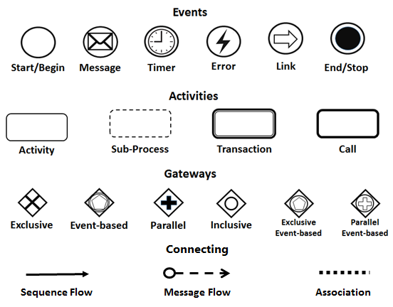
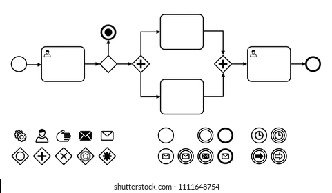
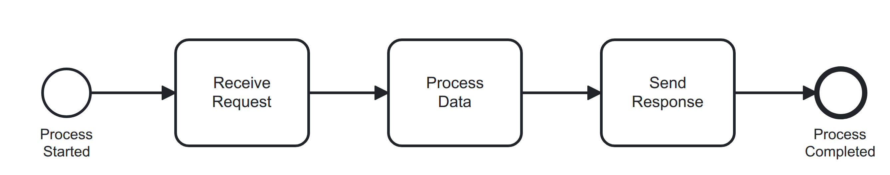
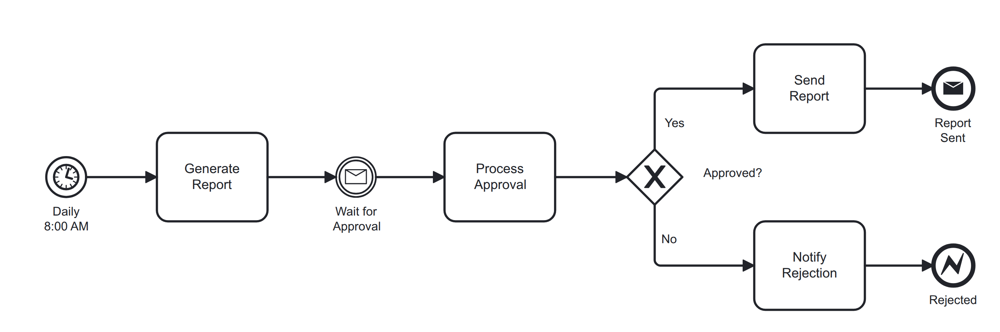
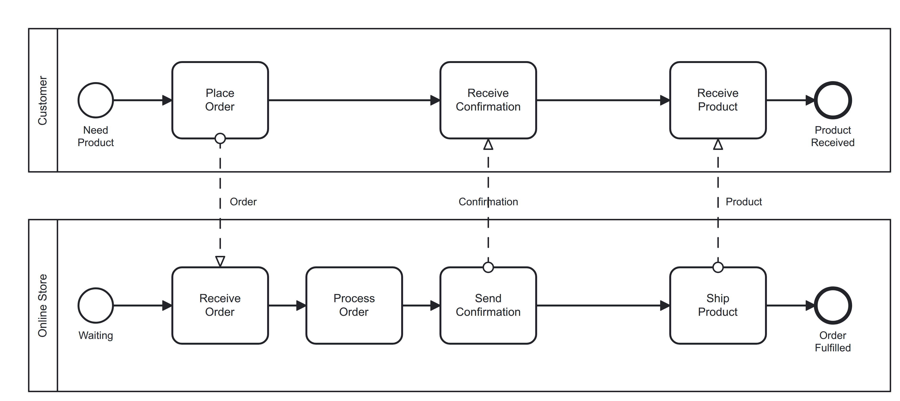
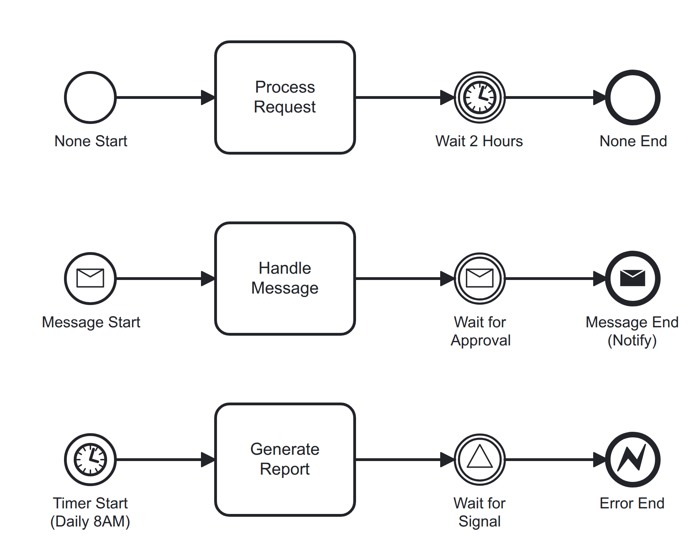
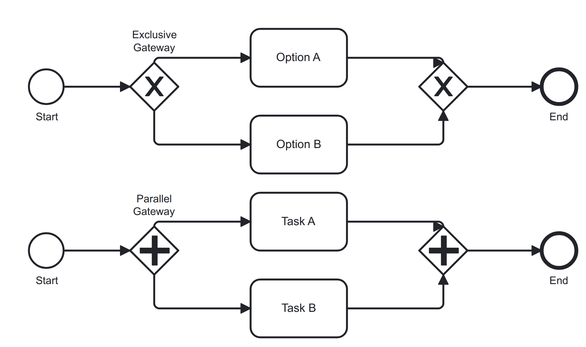

# Lời cảm ơn

Tác giả xin chân thành cảm ơn:

- **TS. Phạm Xuân Kiên** (Khoa Hệ thống Thông tin Quản lý, Trường Đại học Ngân hàng Thành phố Hồ Chí Minh) vì đã giảng dạy môn **Phân tích và Thiết kế Hệ thống Thông tin (ISA 514)**. Môn học đã trang bị nền tảng vững chắc về phân tích và thiết kế hệ thống, trong đó BPMN là công cụ then chốt.

- **Ms. Huỳnh Long Uyển** (Thành viên nhóm nghiên cứu NCKH, Khoa Hệ thống Thông tin Quản lý) đã chia sẻ nhiều góc nhìn thực tiễn và gợi ý quý báu về ứng dụng BPMN trong công việc phân tích nghiệp vụ.

- **Ms. Trần Thị Huỳnh Nhi** (COO tại Deutschfuns) hiện đang học thêm khóa học chuyên môn về Business Analyst, đã giúp làm rõ tính cấp thiết của việc nắm vững BPMN trong môi trường làm việc chuyên nghiệp. Đây là công cụ hỗ trợ AI để vẽ nhanh, chuyển đổi nhanh, phục vụ cho việc xây dựng tài liệu BA (Business Analyst), phân tích hệ thống, phân tích thiết kế hệ thống - giảm tải công việc và tập trung vào ý tưởng cốt lõi.

**Dành tặng**: Mỹ Linh (nghe nói đang làm BA cho một công ty Hàn Quốc nào đó lương cao dữ lắm) và mẹ Nhạn.

---

## Cách đọc tài liệu này

Tài liệu này khá dài (khoảng 750 dòng). Để điều hướng hiệu quả:

**Phương pháp được khuyến nghị:**
1. Sử dụng **smart-search** để tìm kiếm theo từ khóa:
   ```bash
   # Tìm kiếm các phần tử BPMN cụ thể
   smart-search-fz-rg-bm25 "exclusive gateway" --file /home/fong/Projects/mini-rag/.fong/instructions/BPMN/bpmn-vi.md

   # Hiển thị nội dung khớp với số dòng
   smart-search-fz-rg-bm25 "loại sự kiện" --file /home/fong/Projects/mini-rag/.fong/instructions/BPMN/bpmn-vi.md --show-content
   ```
   Xem: `.fong/instructions/smartsearch.md` để biết hướng dẫn đầy đủ.

**Phương pháp thay thế (sed/awk với cửa sổ trượt 5%):**
```bash
# Đọc 38 dòng đầu tiên (5% của 750 dòng)
sed -n '1,38p' .fong/instructions/BPMN/bpmn-vi.md

# Đọc cửa sổ tiếp theo (dòng 39-76)
sed -n '39,76p' .fong/instructions/BPMN/bpmn-vi.md

# Nhảy đến phần cụ thể (ví dụ: dòng 100-138)
sed -n '100,138p' .fong/instructions/BPMN/bpmn-vi.md
```

---

\newpage

## Tổng quan

Tài liệu này cung cấp hướng dẫn toàn diện về BPMN 2.0 (Business Process Model and Notation) và các công cụ liên quan:

- **BPMN 2.0**: Chuẩn quốc tế cho mô hình hóa quy trình nghiệp vụ (ISO/IEC 19510:2013)
- **bpmn-js**: Thư viện JavaScript mã nguồn mở từ bpmn.io để render sơ đồ BPMN trong browser
- **Puppeteer**: Thư viện Node.js để điều khiển Chrome headless, chụp ảnh sơ đồ BPMN
- **bpmn-convert.js**: Script Node.js kết hợp bpmn-js + Puppeteer để chuyển đổi BPMN XML sang PNG/JPG chất lượng cao

---

## BPMN 2.0 là gì?

### Định nghĩa

**BPMN 2.0** là tiêu chuẩn toàn cầu cho biểu diễn đồ họa của các quy trình nghiệp vụ. Được phát triển bởi Business Process Management Initiative (BPMI), hiện được duy trì bởi Object Management Group (OMG).

BPMN 2.0 không chỉ là công cụ vẽ sơ đồ - đây là ngôn ngữ phổ quát giúp các bên cùng hợp tác:

- Chuyên viên phân tích nghiệp vụ
- Người chủ trì quy trình
- Đội ngũ kỹ thuật

### Các tiêu chuẩn quốc tế

- **ISO/IEC 19510:2013**: Tiêu chuẩn ISO chính thức
- **Tiêu chuẩn mở**: Độc lập với nhà cung cấp, mã nguồn mở
- **Khả năng tương tác**: Đảm bảo tương thích giữa các công cụ

---

## Các thành phần cốt lõi của BPMN



*Hình: Tổng quan các phần tử BPMN cốt lõi (Events, Activities, Gateways, Connecting Objects)*

BPMN 2.0 bao gồm các phần tử chuẩn hóa được chia thành 3 nhóm chính:

### Events (Sự kiện)

Đại diện cho các trigger hoặc kết quả trong quy trình:

- **Start Event**: Khởi động quy trình
  *Ví dụ*: "Khách hàng đặt hàng"
- **End Event**: Đánh dấu kết thúc
  *Ví dụ*: "Đơn hàng hoàn thành"
- **Intermediate Event**: Xảy ra trong quá trình thực thi
  *Ví dụ*: "Chờ xác nhận thanh toán"

### Activities (Hoạt động)

Đại diện cho công việc được thực hiện:

- **Task**: Đơn vị công việc đơn lẻ
  *Ví dụ*: "Xác thực đơn hàng"
- **Sub-process**: Nhóm các tasks liên quan
  *Ví dụ*: "Quy trình xử lý đơn hàng"

### Gateways (Cổng điều khiển)

Kiểm soát luồng quy trình:

- Điểm quyết định
- Đường song song
- Định tuyến độc quyền/bao gồm

### Swimlanes (Pools & Lanes)

Tổ chức hoạt động theo bên chịu trách nhiệm:

- Các phòng ban
- Vai trò
- Hệ thống

### Connecting Objects (Đối tượng kết nối)

Liên kết các phần tử:

- **Sequence flows**: Mũi tên chỉ hướng luồng
- **Message flows**: Giao tiếp giữa các bên tham gia

---

## Tham chiếu đầy đủ các phần tử BPMN 2.0



*Hình: Bộ sưu tập icon BPMN đầy đủ*

Phần này cung cấp danh sách đầy đủ TẤT CẢ các phần tử BPMN 2.0 chính thức theo đặc tả OMG (ISO/IEC 19510:2013).

### Flow Objects

**Events**

Events đại diện cho các trigger hoặc kết quả trong quy trình nghiệp vụ. Ký hiệu: **Hình tròn** với biểu tượng bên trong.

**Start Events** (Khởi động quy trình):

| Loại sự kiện | Biểu tượng | Trigger |
|------------|--------|---------|
| None | Tròn rỗng | Quy trình bắt đầu không có trigger cụ thể |
| Message | Tròn + phong bì | Nhận tin nhắn |
| Timer | Tròn + đồng hồ | Điều kiện thời gian/ngày |
| Conditional | Tròn + kim cương | Điều kiện trở thành đúng |
| Signal | Tròn + tam giác | Nhận tín hiệu |
| Error | Tròn + chớp | Điều kiện lỗi |
| Escalation | Tròn + mũi tên đôi | Nhận leo thang |
| Cancel | Tròn + chữ thập | Sự kiện hủy |
| Compensation | Tròn + mũi tên tua lại | Trigger bồi thường |
| Link | Tròn + liên kết | Liên kết từ quy trình khác |
| Multiple | Tròn + dấu sao | Nhiều triggers (bất kỳ) |
| Parallel Multiple | Tròn + đường song song | Nhiều triggers (tất cả) |

**Intermediate Events** (Trong quá trình thực thi):

Hai loại: **Catching** (chờ sự kiện) và **Throwing** (gửi sự kiện)

- Ký hiệu: **Vòng tròn đôi**
- Tất cả các loại start events ở trên, cộng với:
  - Link (Catch/Throw)
  - Message (Catch/Throw)
  - Signal (Catch/Throw)
  - Timer (chỉ Catch)

**End Events** (Kết thúc quy trình):

| Loại sự kiện | Biểu tượng | Kết quả |
|------------|--------|--------|
| None | Tròn đậm | Quy trình kết thúc không có kết quả cụ thể |
| Message | Tròn đậm + phong bì | Gửi tin nhắn và kết thúc |
| Error | Tròn đậm + chớp | Ném lỗi và kết thúc |
| Escalation | Tròn đậm + mũi tên đôi | Leo thang và kết thúc |
| Cancel | Tròn đậm + chữ thập | Hủy giao dịch |
| Compensation | Tròn đậm + tua lại | Kích hoạt bồi thường |
| Signal | Tròn đậm + tam giác | Phát tín hiệu |
| Terminate | Tròn đậm + viền dày | Ngay lập tức kết thúc tất cả activities |
| Multiple | Tròn đậm + dấu sao | Nhiều kết quả |
| Parallel Multiple | Tròn đậm + đường song song | Nhiều kết quả song song |

**Activities**

Activities đại diện cho công việc được thực hiện. Ký hiệu: **Hình chữ nhật bo tròn**.

**Các loại Task**:

| Loại Task | Biểu tượng | Mô tả |
|-----------|------|-------------|
| None (Generic) | (rỗng) | Hoạt động nguyên tử cơ bản |
| User Task | Người | Task do con người thực hiện |
| Manual Task | Bàn tay | Task thủ công không có hệ thống |
| Service Task | Bánh răng | Task tự động của hệ thống |
| Business Rule Task | Cân | Thực thi quy tắc nghiệp vụ |
| Script Task | Script | Thực thi script |
| Send Task | Phong bì gửi | Gửi tin nhắn |
| Receive Task | Phong bì mở | Chờ nhận tin nhắn |

**Sub-Processes**:

| Loại | Marker | Mô tả |
|------|--------|-------------|
| Collapsed | + | Hoạt động phức hợp (ẩn chi tiết) |
| Expanded | (luồng bên trong) | Hiển thị luồng nội bộ chi tiết |
| Event Sub-Process | Viền nét đứt | Kích hoạt bởi sự kiện |
| Ad-Hoc | ~ (dấu ngã) | Hoạt động không theo thứ tự, tùy chọn |

**Special Activities**:

| Loại | Ký hiệu | Mô tả |
|------|----------|-------------|
| Call Activity | Viền dày + plus | Quy trình toàn cục có thể tái sử dụng |
| Transaction | Viền đôi | Ngữ nghĩa giao dịch ACID |

**Activity Markers**:

- **Loop**: Vòng lặp (instance đơn, lặp lại)
- **Multi-Instance Sequential**: Ba đường ngang
- **Multi-Instance Parallel**: Ba đường dọc

**Gateways**

Gateways kiểm soát luồng quy trình. Ký hiệu: **Hình thoi** với biểu tượng bên trong.

| Loại Gateway | Biểu tượng | Logic | Mô tả |
|--------------|--------|-------|-------------|
| Exclusive (XOR) | X | MỘT đường | Chỉ một đường đi (loại trừ lẫn nhau) |
| Inclusive (OR) | Tròn | MỘT+ đường | Một hoặc nhiều đường đi |
| Parallel (AND) | + | TẤT CẢ đường | Tất cả đường đi đồng thời |
| Complex | * | Phức tạp | Điều kiện/đồng bộ phức tạp |
| Event-Based | Ngũ giác | Dựa trên sự kiện | Đường đi tiếp theo dựa trên sự kiện xảy ra |

### Connecting Objects

| Loại đối tượng | Ký hiệu | Mục đích |
|-------------|----------|---------|
| Sequence Flow | Đường liền mũi tên | Thứ tự các activities trong quy trình |
| Message Flow | Đường đứt + tròn + mũi tên | Trao đổi tin nhắn giữa các bên tham gia |
| Association | Đường chấm | Liên kết artifacts với flow objects |
| Data Association | Đường chấm + mũi tên | Quan hệ input/output dữ liệu |

### Swimlanes

| Loại | Mô tả | Mục đích |
|------|-------------|---------|
| Pool | Hình chữ nhật lớn | Đại diện cho bên tham gia/tổ chức |
| Lane | Hình chữ nhật con trong pool | Tổ chức theo vai trò/chức năng/phòng ban |

### Artifacts

| Artifact | Biểu tượng | Mục đích |
|----------|--------|---------|
| Data Object | Biểu tượng tài liệu | Dữ liệu cần thiết/được tạo ra bởi activities |
| Data Input | Tài liệu + mũi tên vào | Dữ liệu đầu vào cho quy trình |
| Data Output | Tài liệu + mũi tên ra | Dữ liệu đầu ra từ quy trình |
| Data Store | Hình trụ | Lưu trữ dữ liệu bền vững |
| Group | Hình chữ nhật bo tròn viền đứt | Nhóm trực quan (không ảnh hưởng luồng) |
| Text Annotation | Văn bản trong ngoặc | Ghi chú/bình luận mô tả |

### Các loại sơ đồ BPMN

| Loại sơ đồ | Mô tả | Trường hợp sử dụng |
|--------------|-------------|----------|
| **Process Diagram** | Luồng quy trình nội bộ trong một bên tham gia | Quy trình làm việc vận hành chi tiết |
| **Collaboration Diagram** | Tương tác giữa nhiều bên tham gia | Quy trình liên tổ chức |
| **Choreography Diagram** | Chuỗi trao đổi tin nhắn giữa các bên tham gia | Định nghĩa giao thức, không có chi tiết nội bộ |
| **Conversation Diagram** | Cuộc hội thoại trừu tượng dưới dạng nodes | Tổng quan giao tiếp cấp cao |

---

## Lợi ích của BPMN

### Rõ ràng và Giao tiếp

Biểu diễn trực quan cải thiện sự hiểu biết của các bên liên quan.

### Tiêu chuẩn hóa

Đảm bảo tính nhất quán và khả năng tương tác giữa các công cụ và tổ chức.

### Tối ưu hóa Quy trình

Xác định điểm nghẽn, không hiệu quả và cơ hội cải tiến.

### Hợp tác

Bắc cầu giữa đội ngũ nghiệp vụ và kỹ thuật.

### Sẵn sàng Tự động hóa

Mô hình có thể được sử dụng trực tiếp cho tự động hóa và thực thi quy trình.

---

## Công cụ chuyển đổi BPMN sang hình ảnh

### Cài đặt

Script `bpmn-convert.js` yêu cầu Node.js và Puppeteer.

**Yêu cầu**

```bash
# Kiểm tra phiên bản Node.js (yêu cầu Node 18+)
node --version

# Cài đặt Puppeteer (nếu chưa có)
cd /home/fong/Projects/mini-rag
npm install puppeteer
```

**Vị trí Script**

```
.fong/instructions/BPMN/bpmn-convert.js
```

### Sử dụng cơ bản

Chuyển đổi BPMN XML sang PNG (mặc định: A4 dọc):

```bash
node .fong/instructions/BPMN/bpmn-convert.js input.bpmn output.png
```

### Tham chiếu lệnh

**Cú pháp**

```bash
node bpmn-convert.js <input.bpmn> <output.png|jpg> [options]
```

**Tùy chọn**

| Tùy chọn | Giá trị | Mô tả | Mặc định |
|--------|--------|-------------|---------|
| `--orientation` | `portrait`, `landscape` | Hướng trang | `portrait` |
| `--format` | `png`, `jpg` | Định dạng đầu ra (tự động phát hiện từ phần mở rộng) | Từ phần mở rộng |
| `--quality` | `1-100` | Chất lượng JPEG (chỉ cho JPG) | `90` |

**Kích thước A4**

- **Portrait (Dọc)**: 2480 x 3508 pixels (210mm x 297mm @ 300 DPI)
- **Landscape (Ngang)**: 3508 x 2480 pixels (297mm x 210mm @ 300 DPI)

**Lưu ý**: Độ phân giải cao (300 DPI) đảm bảo chất lượng in ấn. Hình ảnh được tự động crop về nội dung sơ đồ và bao gồm watermark BPMN.IO.

### Ví dụ

**Ví dụ 1: Chuyển đổi sang PNG (Dọc)**

```bash
node .fong/instructions/BPMN/bpmn-convert.js diagram.bpmn output.png
```

**Đầu ra:**
```
✓ Successfully converted BPMN to output.png
  Orientation: portrait (2480x3508px)
  Format: PNG
  File size: 29.3 KB
```

**Ví dụ 2: Chuyển đổi sang PNG (Ngang)**

```bash
node .fong/instructions/BPMN/bpmn-convert.js diagram.bpmn output.png --orientation landscape
```

**Ví dụ 3: Chuyển đổi sang JPG (Chất lượng cao)**

```bash
node .fong/instructions/BPMN/bpmn-convert.js diagram.bpmn output.jpg --quality 95
```

**Ví dụ 4: Landscape JPG**

```bash
node .fong/instructions/BPMN/bpmn-convert.js diagram.bpmn report.jpg --orientation landscape --quality 85
```

### Xử lý sự cố

**Lỗi: "Failed to launch the browser process"**

**Nguyên nhân**: Hạn chế sandbox của Puppeteer trên Ubuntu.

**Giải pháp**: Script đã bao gồm các flags `--no-sandbox`. Đảm bảo Puppeteer đã được cài đặt:

```bash
npm install puppeteer
```

**Lỗi: "Input file not found"**

**Nguyên nhân**: Đường dẫn file không chính xác.

**Giải pháp**: Sử dụng đường dẫn tuyệt đối hoặc tương đối chính xác:

```bash
# Đường dẫn tuyệt đối
node .fong/instructions/BPMN/bpmn-convert.js /home/fong/Projects/mini-rag/example-process.bpmn output.png

# Đường dẫn tương đối
node .fong/instructions/BPMN/bpmn-convert.js ./example-process.bpmn ./output.png
```

**Lỗi: "Failed to render BPMN"**

**Nguyên nhân**: Cú pháp BPMN XML không hợp lệ.

**Giải pháp**: Xác thực cú pháp BPMN XML:

1. Kiểm tra file XML có đúng format BPMN 2.0 không
2. Xác thực bằng BPMN editor online (bpmn.io) hoặc XML validator
3. Sửa lỗi cú pháp và lưu
4. Thử chuyển đổi lại

---

## Các mẫu sơ đồ BPMN

Phần này cung cấp các ví dụ sơ đồ BPMN sẵn sàng sử dụng để minh họa các phần tử và mẫu khác nhau.

### Tổng quan các mẫu

| Mẫu | File | Mô tả | Các phần tử được minh họa |
|--------|------|-------------|----------------------|
| 01 | `01-basic-process.bpmn` | Quy trình tuyến tính đơn giản | Start Event, Tasks, End Event, Sequence Flows |
| 02 | `02-exclusive-gateway.bpmn` | Định tuyến dựa trên quyết định | Exclusive Gateway (XOR), luồng có điều kiện, mẫu merge |
| 03 | `03-parallel-gateway.bpmn` | Thực thi task đồng thời | Parallel Gateway (AND), mẫu fork-join |
| 04 | `04-event-types.bpmn` | Các loại events khác nhau | Timer Start, Intermediate Message, Error/Message End Events |
| 05 | `05-collaboration.bpmn` | Quy trình nhiều bên tham gia | Pools, Message Flows, Collaboration Diagram |

### Chi tiết các mẫu

**Mẫu 01: Quy trình tuyến tính cơ bản**

**File**: `.fong/instructions/BPMN/samples/01-basic-process.bpmn`

**Mô tả**: Quy trình tuần tự đơn giản với ba tasks.

**Các phần tử**:

- 1 Start Event
- 3 Tasks (Nhận yêu cầu, Xử lý dữ liệu, Gửi phản hồi)
- 1 End Event
- 4 Sequence Flows

**Trường hợp sử dụng**: Giới thiệu cơ bản về BPMN, quy trình phê duyệt đơn giản.





**Mẫu 02: Exclusive Gateway (Điểm quyết định)**

**File**: `.fong/instructions/BPMN/samples/02-exclusive-gateway.bpmn`

**Mô tả**: Quy trình với phân nhánh có điều kiện dựa trên ngưỡng số tiền.

**Các phần tử**:

- Exclusive Gateway (XOR): "Số tiền > $1000?"
- Hai đường thay thế: Phê duyệt quản lý vs Phê duyệt tự động
- Mẫu merge gateway
- Luồng có điều kiện được gắn nhãn ("Yes"/"No")

**Trường hợp sử dụng**: Quy trình phê duyệt, định tuyến có điều kiện, quy trình dựa trên quyết định.


**Mẫu 03: Parallel Gateway (Thực thi đồng thời)**

**File**: `.fong/instructions/BPMN/samples/03-parallel-gateway.bpmn`

**Mô tả**: Xử lý đơn hàng với thực thi tasks song song.

**Các phần tử**:

- Parallel Gateway (Fork): Chia thành 3 tasks đồng thời
- 3 Parallel Tasks: Kiểm tra tồn kho, Xử lý thanh toán, Thông báo khách hàng
- Parallel Gateway (Join): Chờ tất cả tasks hoàn thành
- Mẫu Fork-Join

**Trường hợp sử dụng**: Hoạt động đồng thời, quy trình song song, quy trình đa luồng.


**Mẫu 04: Các loại Events**

**File**: `.fong/instructions/BPMN/samples/04-event-types.bpmn`

**Mô tả**: Quy trình tạo báo cáo với các loại events khác nhau.

**Các phần tử**:

- Timer Start Event: "Hàng ngày 8:00 sáng"
- Intermediate Catch Event (Message): "Chờ phê duyệt"
- Message End Event: "Báo cáo đã gửi"
- Error End Event: "Bị từ chối"
- Kết hợp với Exclusive Gateway

**Trường hợp sử dụng**: Quy trình theo lịch, quy trình dựa trên tin nhắn, xử lý lỗi.





**Mẫu 05: Sơ đồ Collaboration**

**File**: `.fong/instructions/BPMN/samples/05-collaboration.bpmn`

**Mô tả**: Quy trình đặt hàng trực tuyến cho thấy tương tác giữa Khách hàng và Cửa hàng.

**Các phần tử**:

- 2 Pools: Khách hàng, Cửa hàng trực tuyến
- 3 Message Flows: Đơn hàng, Xác nhận, Sản phẩm
- Quy trình riêng biệt cho mỗi bên tham gia
- Hợp tác liên tổ chức

**Trường hợp sử dụng**: Quy trình B2B, tích hợp hệ thống, quy trình liên phòng ban.





**Mẫu 06: Tất cả các loại Events**





**Mẫu 07: Tất cả các loại Tasks**


**Mẫu 08: Các loại Gateway**





### Hướng dẫn sử dụng

**Xem sơ đồ**

Sử dụng BPMN editor online (bpmn.io/demo) hoặc các công cụ BPMN editor khác.

**Chuyển đổi sang hình ảnh**

Sử dụng bpmn-convert.js:

```bash
# Portrait (mặc định)
node .fong/instructions/BPMN/bpmn-convert.js .fong/instructions/BPMN/samples/01-basic-process.bpmn output.png

# Landscape
node .fong/instructions/BPMN/bpmn-convert.js .fong/instructions/BPMN/samples/01-basic-process.bpmn output.png --orientation landscape
```

**Chỉnh sửa mẫu**

1. Mở bằng BPMN editor (bpmn.io/demo hoặc các công cụ khác)
2. Chỉnh sửa phần tử, thuộc tính hoặc bố cục
3. Lưu file BPMN XML
4. Chuyển đổi sang PNG cho tài liệu

---

## Thực hành tốt nhất

### Quy ước đặt tên

- **Tasks**: Sử dụng định dạng động từ + danh từ
  *Ví dụ*: "Xử lý đơn hàng", "Gửi email", "Xác thực thanh toán"
- **Gateways**: Sử dụng câu hỏi
  *Ví dụ*: "Đã nhận thanh toán?", "Hàng có sẵn?", "Đơn hàng hợp lệ?"
- **Events**: Sử dụng tên mô tả
  *Ví dụ*: "Khách hàng đặt hàng", "Đơn hàng hoàn thành", "Hết thời gian thanh toán"

### Đơn giản

- Giữ sơ đồ đơn giản: Tối đa 10-15 phần tử mỗi sơ đồ
- Sử dụng **sub-processes** cho logic phức tạp
- Chia quy trình lớn thành nhiều sơ đồ

### Swimlanes

- Sử dụng pools/lanes để xác định rõ trách nhiệm
- Căn chỉnh lanes với cấu trúc tổ chức
- Giữ swimlanes theo chiều ngang để dễ đọc

### Xác thực

- Luôn xác thực trước khi xuất hoặc chia sẻ
- Giải quyết tất cả lỗi và cảnh báo
- Kiểm tra logic luồng quy trình

### Kiểm soát phiên bản

Theo dõi files BPMN trong Git:

```bash
# Thêm files BPMN
git add *.bpmn

# Commit với thông điệp mô tả
git commit -m "feat: add customer onboarding process diagram"

# Theo dõi hình ảnh đã xuất (tùy chọn)
git add docs/diagrams/*.png
```

---

## Tài liệu tham khảo

### Tài nguyên chính thức

- **BPMN 2.0 Specification (OMG)**: https://www.omg.org/spec/BPMN/2.0/
- **ISO/IEC 19510:2013**: https://www.iso.org/standard/62652.html
- **bpmn.io - Online Editor**: https://demo.bpmn.io/
- **bpmn-js GitHub**: https://github.com/bpmn-io/bpmn-js

### Tài nguyên học tập

- **BPMN Quick Guide**: https://www.bpmn.org/
- **bpmn.io Documentation**: https://bpmn.io/toolkit/bpmn-js/
- **Flowable BPMN Guide**: https://www.flowable.com/open-source/docs/bpmn/

---

## Xử lý sự cố

### Lỗi "Failed to launch browser"

**Nguyên nhân**: Thiếu dependencies cho Chrome headless.

**Giải pháp**:

```bash
# Ubuntu/Debian
sudo apt update
sudo apt install -y libx11-xcb1 libxcb-dri3-0 libdrm2 libgbm1 libnss3 libxss1 libasound2
```

### PNG Export có chất lượng thấp

**Giải pháp**: Sử dụng tham số `--dpi` để tăng độ phân giải:

```bash
node bpmn-convert.js input.bpmn output.png --dpi 600
```

---

## Kết luận

BPMN 2.0 cung cấp giải pháp mạnh mẽ, được tiêu chuẩn hóa cho mô hình hóa quy trình nghiệp vụ. Kết hợp với bpmn-js và Puppeteer, chúng ta có thể:

- Biểu diễn trực quan các quy trình
- Tuân thủ chuẩn quốc tế (ISO/IEC 19510:2013)
- Tự động hóa chuyển đổi sang hình ảnh chất lượng cao
- Tích hợp vào workflow CI/CD và documentation automation

Công cụ này hỗ trợ Business Analyst giảm tải công việc thủ công và tập trung vào phân tích nghiệp vụ cốt lõi.

---

**Nguồn**: OMG BPMN 2.0 Specification + bpmn.io documentation
**Tham chiếu**: ISO/IEC 19510:2013
**Cập nhật**: 2025-11-06
**Phiên bản**: 0.3
