# Textor Doc Converter - User Guide (Mermaid & PlantUML)

**📖 Đọc file này:**
- **Recommended**: Đọc `head -100` trước để nắm overview
- **Phần còn lại**: Dựa vào Table of Contents, dùng `sed` với windows 5% để đọc các section cụ thể
- **Example**: `sed -n '100,200p' file.md` để đọc dòng 100-200

**📚 Reference Files (Absolute Paths):**
- **PlantUML Salt Reference**: `/home/fong/Projects/textor-doc-converter/docs/plantuml-salt-reference.md` (6.9K)
  - Complete Salt widget syntax and examples
  - UI mockup templates and patterns
- **Mermaid Reference**: `/home/fong/Projects/textor-doc-converter/docs/mermaid-reference.md` (14K)
  - All 13 Mermaid diagram types with examples
  - Syntax cheat sheets and best practices

**Tool**: Document Converter CLI
**Script Path**: `/home/fong/Projects/textor-doc-converter/run-807f321188c6.sh`
**Version**: 2.2.0 - Added XeLaTeX Alternative for No-Diagram Files
**Date**: 2025-10-30

---

## CRITICAL: Emoji Usage Rule

**BẮT BUỘC - MANDATORY:** KHÔNG TỰ Ý DÙNG EMOJI trong markdown content.

**Quy tắc:**
- ❌ **KHÔNG** tự ý thêm emoji vào document content
- ❌ **KHÔNG** dùng emoji trong headings, body text, examples
- ✅ **CHỈ DÙNG** khi user EXPLICITLY yêu cầu
- ✅ **EXCEPTION**: Technical warnings/notes trong instructions (như file này) - chấp nhận được

**Lý do:**
- XeLaTeX engine không render emoji (converts to text placeholders)
- Professional documentation không nên có emoji
- Consistency với coding standards (CLAUDE.md)

**Áp dụng cho:**
- PRD documents (Product Requirements)
- Technical specifications
- API documentation
- Changelog files
- All markdown files cần convert sang PDF

**Reference:**
- CLAUDE.md: "Only use emojis if the user explicitly requests it"
- CLAUDE.local.md: "Avoid adding emojis to files unless asked"

---

## CRITICAL: Markdown Heading Depth Rule

**BẮT BUỘC - MANDATORY:** Tối đa 3 cấp heading (H1, H2, H3) trong documents.

**Quy tắc Tuyệt Đối:**
- H1 (#): Document title (YAML title only - KHÔNG dùng trong content)
- H2 (##): Main sections
- H3 (###): Sub-sections
- **KHÔNG DÙNG H4 (####)** trở xuống

**Lý do:**
- Clean Code principle: Simple document structure
- Better readability: Max 3 levels prevents complexity
- XeLaTeX rendering: Works best with 3-level hierarchy
- Professional documentation standard

**Thay thế H4:**
- Use **bold text** for sub-item titles within H3 sections
- Example:
  ```markdown
  ### Bug Fixes


  **Fix login issue**

  - Description here
  - Details here
  ```

**Áp dụng cho:**
- PRD documents
- Technical specifications
- Changelogs
- API documentation
- All documents converted by Textor

**Reference:**
- Clean Code (Robert Martin): "Newspaper Metaphor"
- Technical Writing Best Practices: 3-level hierarchy standard

---

## CRITICAL: Markdown Spacing Rule

**BẮT BUỘC - MANDATORY:** Giữa headers và nội dung chính, hoặc giữa bold text và nội dung chính phải có **2 newlines** (1 dòng trống).

**Quy tắc:**


- ✅ **Header → 2 newlines → Content**
  ```markdown
  ### 2.2 File Inventory


  **Configuration Files**:
  ```

- ✅ **Bold text → 2 newlines → Content**
  ```markdown
  **Request Headers**:


  - Content-Type: application/json
  ```

- ❌ **SAI - Chỉ 1 newline**
  ```markdown
  ### 2.2 File Inventory
  **Configuration Files**:
  ```

**Lý do:**
- Cải thiện readability trong markdown
- Tương thích tốt với PDF conversion engines (Pandoc, XeLaTeX)
- Tạo khoảng cách hợp lý giữa các sections

**Áp dụng cho:**
- Technical documentation
- API specifications
- Instruction guides
- All markdown files (đặc biệt là files cần convert PDF)

**Auto-fix Script:**
```python
# Fix spacing automatically
import re
with open('file.md', 'r') as f:
    lines = f.readlines()

fixed = []
for i, line in enumerate(lines):
    fixed.append(line)
    # After headers or bold text, add extra newline if needed
    if re.match(r'^#{1,3}\s+.*$|^\*\*.*\*\*:\s*$', line.strip()):
        if i+1 < len(lines) and lines[i+1].strip():
            fixed.append('\n')

with open('file.md', 'w') as f:
    f.writelines(fixed)
```

---

## 📑 Table of Contents

1. [Overview](#overview)
2. [Usage](#usage)
   - [Gọi Script với Absolute Path](#gọi-script-với-absolute-path)
   - [Xem Full Help](#xem-full-help)
3. [Command Examples](#command-examples)
   - [Validate PlantUML Code](#1-validate-plantuml-code)
   - [Validate Mermaid Code](#2-validate-mermaid-code)
   - [Validate Markdown với PlantUML](#3-validate-markdown-với-plantuml)
   - [Validate Markdown với Mermaid](#4-validate-markdown-với-mermaid)
   - [Export Markdown to PDF](#5-export-markdown-to-pdf)
4. [Mermaid Diagram Guide](#mermaid-diagram-guide)
   - [Supported Diagram Types](#supported-diagram-types)
   - [Mermaid Syntax Examples](#mermaid-syntax-examples)
5. [PlantUML Diagram Guide](#plantuml-diagram-guide)
   - [Supported Diagram Types](#plantuml-supported-diagram-types)
   - [PlantUML Syntax Examples](#plantuml-syntax-examples)
6. [PlantUML Salt - UI Mockup & Wireframe Guide](#plantuml-salt---ui-mockup--wireframe-guide)
   - [What is Salt?](#what-is-salt)
   - [Basic Widgets](#basic-widgets)
   - [Grid Layout](#grid-layout)
   - [Advanced Features](#advanced-features)
7. [Alternative: Direct Pandoc with XeLaTeX (No Diagrams)](#alternative-direct-pandoc-with-xelatex-no-diagrams)
   - [When to Use](#when-to-use)
   - [Command Pattern](#command-pattern)
   - [Real Example](#real-example)
   - [Comparison: Textor vs XeLaTeX](#comparison-textor-vs-xelatex)
8. [Important Notes](#important-notes)
9. [Quick Reference](#quick-reference)

---

## Overview

Textor Doc Converter là CLI tool để validate và convert markdown documents với diagram support (PlantUML + Mermaid) sang PDF format.

**Key Features:**
- ✅ Validate PlantUML diagrams (real errors từ PlantUML server)
- ✅ Validate Mermaid diagrams (real errors từ mermaid-cli)
- ✅ Export markdown to PDF with embedded diagrams
- ✅ Support mixed PlantUML + Mermaid trong cùng 1 document

---

## Usage

### Gọi Script với Absolute Path

```bash
/home/fong/Projects/textor-doc-converter/run-807f321188c6.sh '<JSON_PARAMS>'
```

### Xem Full Help

```bash
# Show complete documentation
/home/fong/Projects/textor-doc-converter/run-807f321188c6.sh --help

# hoặc
/home/fong/Projects/textor-doc-converter/run-807f321188c6.sh '{"command":"help"}'
```

---

## Command Examples

**⚠️ LƯU Ý:** Các examples dưới đây chỉ là **minh họa**. Còn nhiều commands và options khác. Chạy `--help` để xem **FULL DOCUMENTATION**.

### 1. Validate PlantUML Code

```bash
/home/fong/Projects/textor-doc-converter/run-807f321188c6.sh '{"command":"validate-plantuml","data":"@startuml\nAlice->Bob\n@enduml"}'
```

### 2. Validate Mermaid Code

```bash
/home/fong/Projects/textor-doc-converter/run-807f321188c6.sh '{"command":"validate-mermaid","data":"graph LR\nA-->B"}'
```

### 3. Validate Markdown với PlantUML

```bash
/home/fong/Projects/textor-doc-converter/run-807f321188c6.sh '{"command":"validate-md-plantuml","data":"docs/example.md"}'
```

### 4. Validate Markdown với Mermaid

```bash
/home/fong/Projects/textor-doc-converter/run-807f321188c6.sh '{"command":"validate-md-mermaid","data":"tests/test-mermaid.md"}'
```

### 5. Export Markdown to PDF

```bash
# Default A4 portrait
/home/fong/Projects/textor-doc-converter/run-807f321188c6.sh '{"command":"export-md-to-pdf","data":"docs/example.md"}'

# A4 landscape
/home/fong/Projects/textor-doc-converter/run-807f321188c6.sh '{"command":"export-md-to-pdf","data":"docs/example.md","page_size":"A4","orientation":"landscape"}'

# Mixed diagrams (PlantUML + Mermaid)
/home/fong/Projects/textor-doc-converter/run-807f321188c6.sh '{"command":"export-md-to-pdf","data":"tests/plantuml-mermaid.md"}'
```

---

## Mermaid Diagram Guide

### Supported Diagram Types

Textor Doc Converter hỗ trợ **13 loại Mermaid diagrams** (commonly supported):

1. **Flowchart** - Sơ đồ luồng
2. **Class Diagram** - Sơ đồ lớp (OOP)
3. **Sequence Diagram** - Sơ đồ tuần tự
4. **ER Diagram** - Sơ đồ thực thể quan hệ (Database)
5. **State Diagram** - Sơ đồ trạng thái
6. **Mindmap** - Sơ đồ tư duy
7. **Gantt Chart** - Biểu đồ Gantt (Project timeline)
8. **Git Graph** - Sơ đồ Git branches
9. **Pie Chart** - Biểu đồ tròn
10. **Quadrant Chart** - Biểu đồ phân vùng
11. **Requirement Diagram** - Sơ đồ yêu cầu
12. **Timeline** - Dòng thời gian
13. **User Journey** - Hành trình người dùng

**Note:** Một số diagram types beta (architecture-beta, block-beta, C4Context, kanban, packet, radar-beta, sankey-beta, treemap-beta, xychart-beta, zenuml) có thể require specific Mermaid versions.

---

### Mermaid Syntax Examples

#### 1. Flowchart (Sơ đồ luồng)

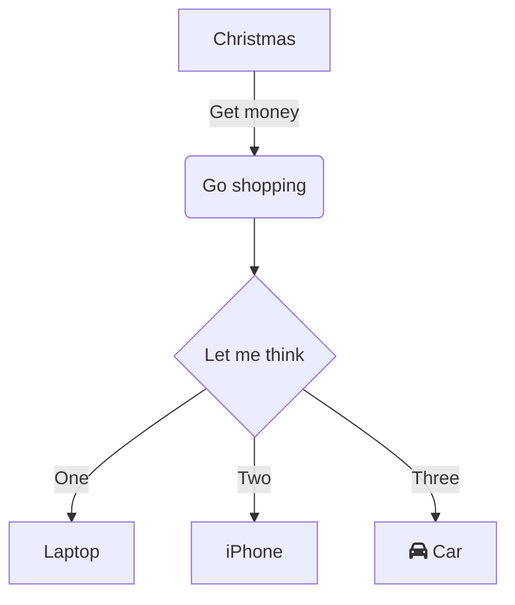

**Use Cases:**
- Quy trình nghiệp vụ (Business process flow)
- Thuật toán (Algorithm steps)
- Decision making flow

**Syntax:**
- `flowchart TD` = Top-Down direction
- `flowchart LR` = Left-Right direction
- `A[Text]` = Rectangle node
- `B(Text)` = Rounded node
- `C{Text}` = Diamond (decision)
- `-->` = Arrow connection
- `-->|Label|` = Labeled arrow

---

#### 2. Class Diagram (Sơ đồ lớp OOP)

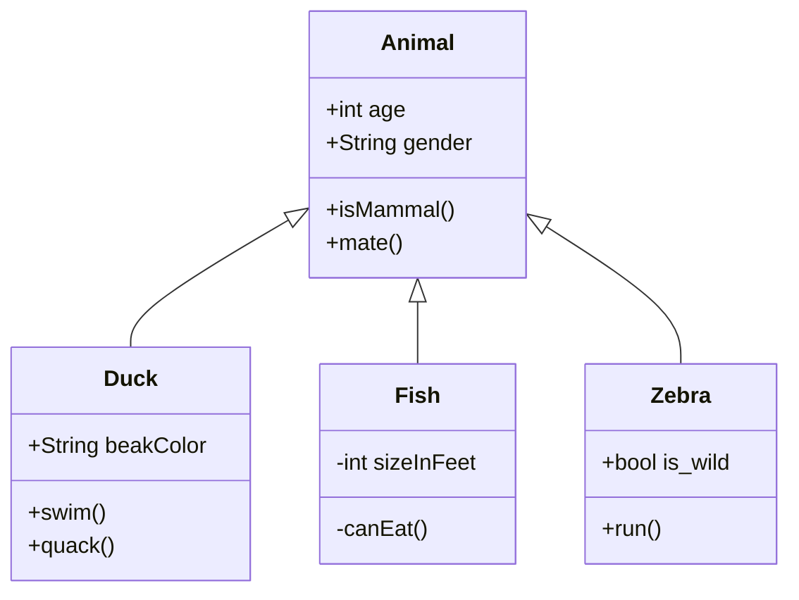

**Use Cases:**
- OOP design documentation
- Class relationships (inheritance, aggregation)
- System architecture

**Syntax:**
- `<|--` = Inheritance
- `+` = Public member
- `-` = Private member
- `ClassName : +type field` = Property
- `ClassName: +method()` = Method

---

#### 3. Sequence Diagram (Sơ đồ tuần tự)

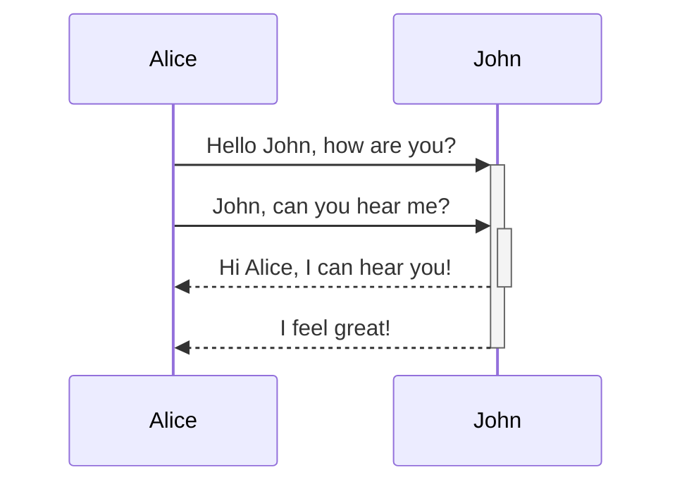

**Use Cases:**
- API interaction flows
- System component communication
- Message passing between objects

**Syntax:**
- `->>` = Solid arrow (synchronous message)
- `-->>` = Dashed arrow (response)
- `+` = Activate lifeline
- `-` = Deactivate lifeline

---

#### 4. ER Diagram (Entity-Relationship)

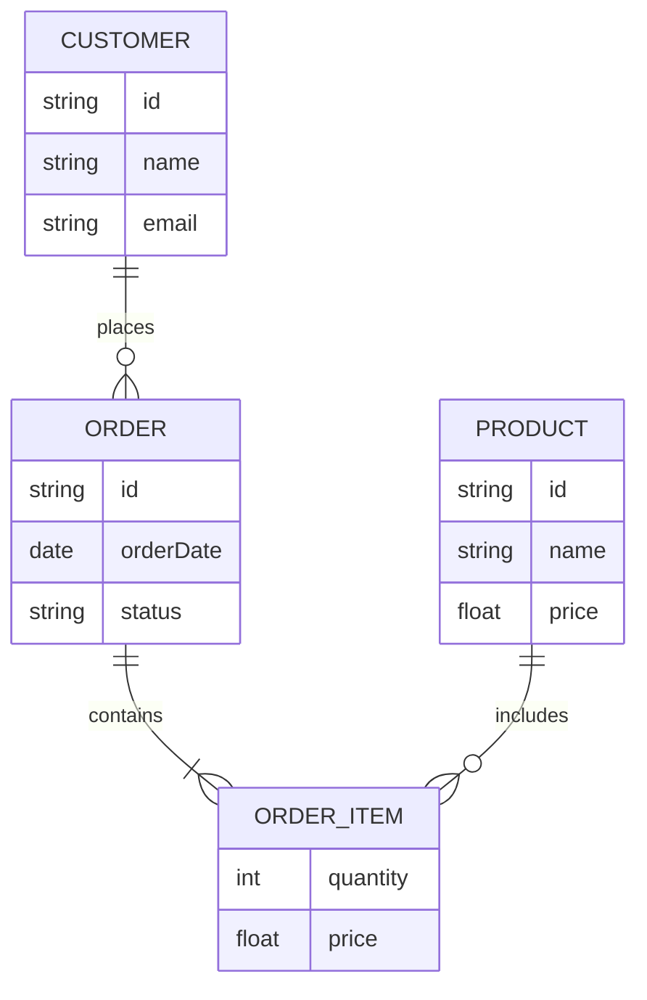

**Use Cases:**
- Database schema design
- Data modeling
- Relationship mapping

**Syntax:**
- `||--o{` = One-to-many relationship
- `||--|{` = One-to-one or one-to-many
- `EntityName { type field }` = Entity attributes

---

#### 5. State Diagram (Sơ đồ trạng thái)

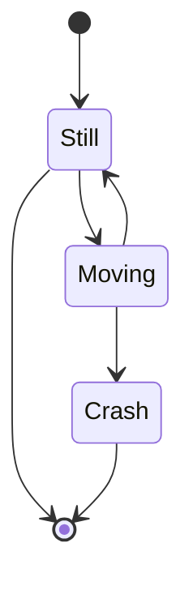

**Use Cases:**
- State machine design
- Workflow states
- Object lifecycle

**Syntax:**
- `[*]` = Start/End state
- `State1 --> State2` = Transition

---

#### 6. Gantt Chart (Biểu đồ tiến độ)

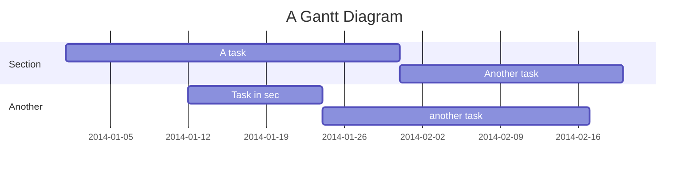

**Use Cases:**
- Project timeline planning
- Task scheduling
- Resource allocation

**Syntax:**
- `section Name` = Group tasks
- `Task : id, start, duration` = Task definition
- `after id` = Dependency

---

#### 7. Git Graph (Sơ đồ Git)

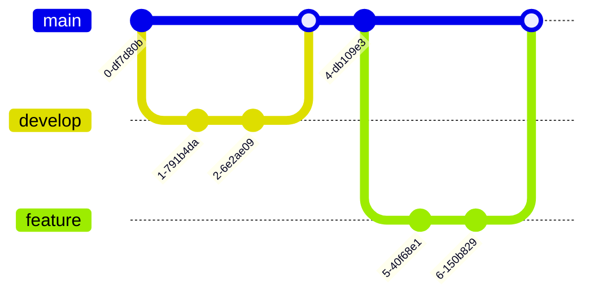

**Use Cases:**
- Git workflow visualization
- Branch strategy documentation
- Release planning

---

#### 8. Pie Chart (Biểu đồ tròn)

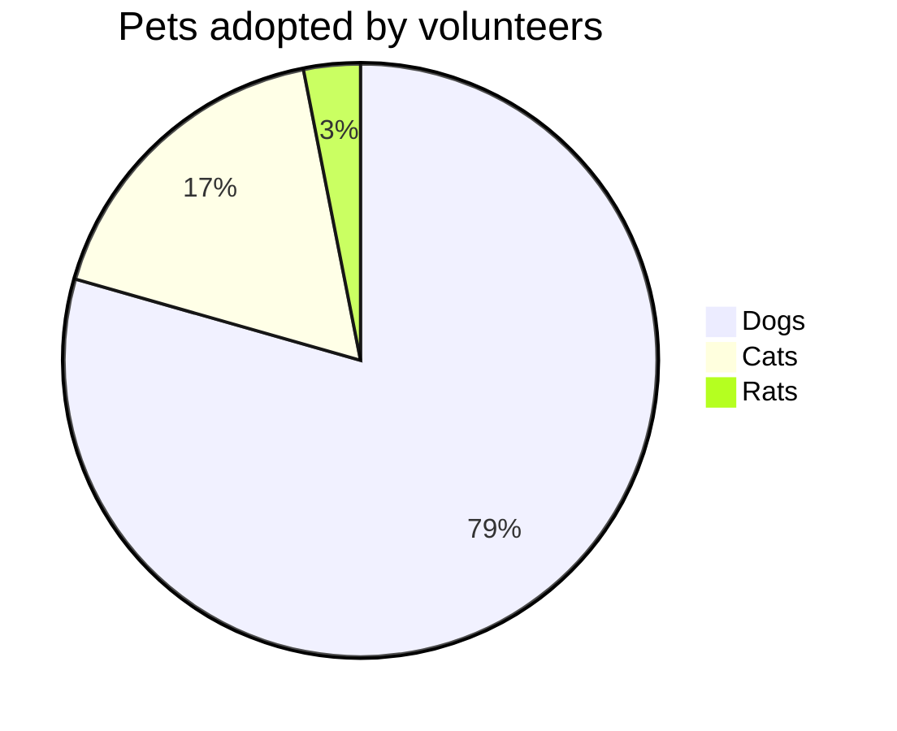

**Use Cases:**
- Data distribution visualization
- Percentage breakdown
- Statistics reporting

---

#### 9. Mindmap (Sơ đồ tư duy)

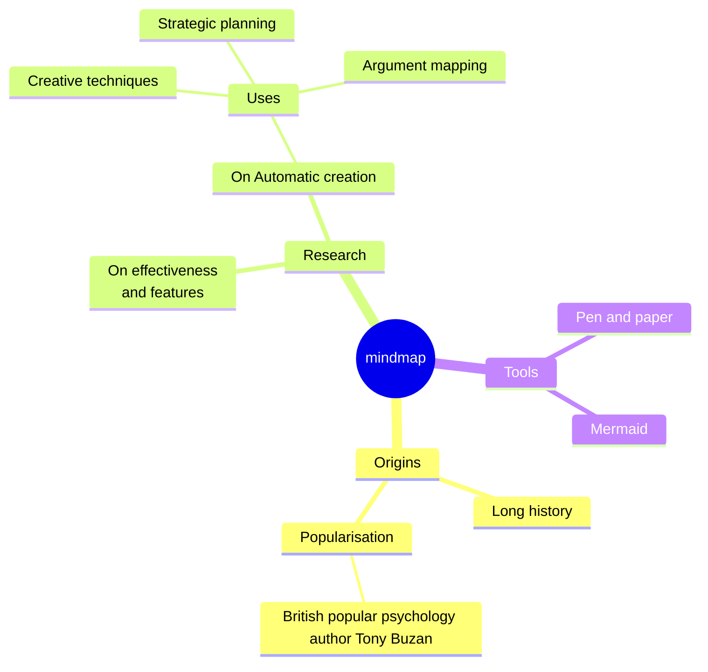

**Use Cases:**
- Brainstorming
- Knowledge organization
- Concept mapping

---

#### 10. Timeline (Dòng thời gian)

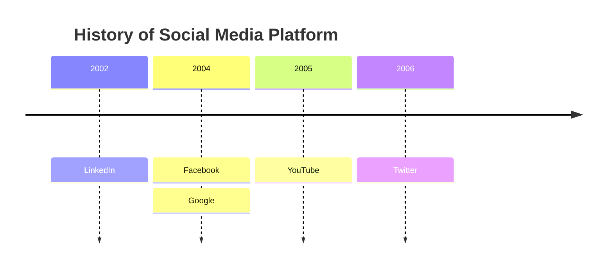

**Use Cases:**
- Historical events
- Product roadmap
- Milestones tracking

---

#### 11. User Journey (Hành trình người dùng)

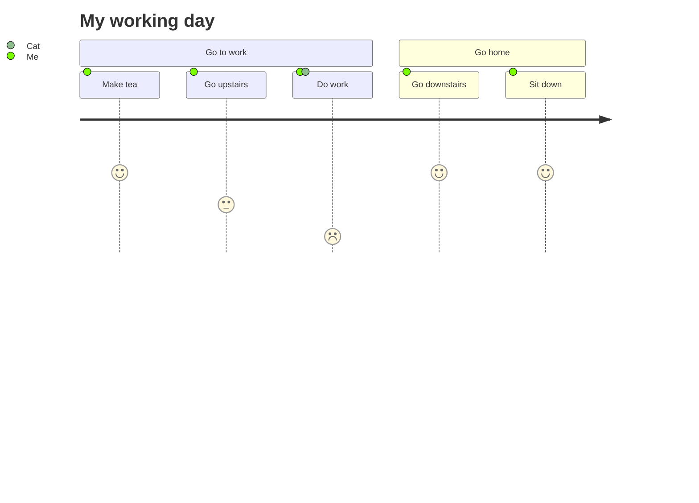

**Use Cases:**
- UX design
- Customer experience mapping
- Process satisfaction analysis

**Syntax:**
- `Task: score: Actor` = Journey step with satisfaction score (1-5)

---

## PlantUML Diagram Guide

### PlantUML Supported Diagram Types

PlantUML hỗ trợ nhiều loại diagrams:

1. **Sequence Diagram** - Sơ đồ tuần tự
2. **Use Case Diagram** - Sơ đồ use case
3. **Class Diagram** - Sơ đồ lớp
4. **Activity Diagram** - Sơ đồ hoạt động
5. **Component Diagram** - Sơ đồ thành phần
6. **State Diagram** - Sơ đồ trạng thái
7. **Object Diagram** - Sơ đồ đối tượng
8. **Deployment Diagram** - Sơ đồ triển khai
9. **Timing Diagram** - Sơ đồ thời gian
10. **Network Diagram** - Sơ đồ mạng
11. **JSON/YAML Data** - Visualization

---

### PlantUML Syntax Examples

#### 1. Sequence Diagram

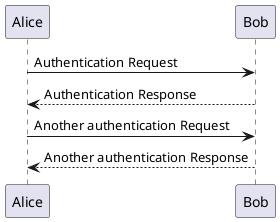

**Use Cases:**
- API interactions
- System communication
- Message flow

**Syntax:**
- `@startuml` / `@enduml` = Wrapper
- `->` = Solid arrow (message)
- `-->` = Dashed arrow (response)

---

#### 2. Use Case Diagram

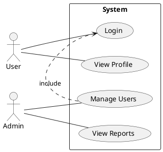

**Use Cases:**
- Requirements analysis
- System functionality
- User interactions

**Syntax:**
- `actor Name` = Actor
- `(Use Case)` = Use case
- `--` = Association
- `.>` = Include/Extend relationship

---

#### 3. Class Diagram

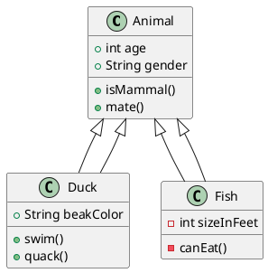

**Use Cases:**
- OOP design
- System architecture
- Class relationships

**Syntax:**
- `class Name { }` = Class definition
- `+` = Public
- `-` = Private
- `<|--` = Inheritance

---

#### 4. Activity Diagram

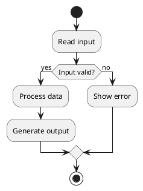

**Use Cases:**
- Business process
- Algorithm flow
- Workflow

**Syntax:**
- `start` / `stop` = Start/End
- `:Action;` = Activity
- `if (condition) then` = Decision

---

#### 5. Component Diagram

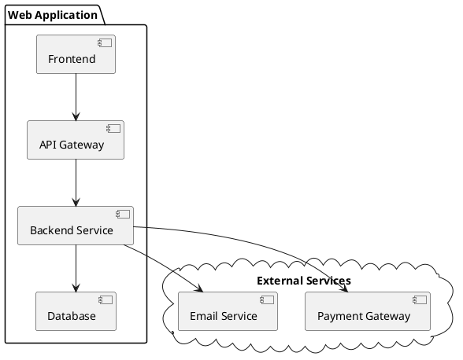

**Use Cases:**
- System architecture
- Component dependencies
- Service integration

**Syntax:**
- `package "Name" { }` = Package/Group
- `[Component]` = Component
- `-->` = Dependency

---

## PlantUML Salt - UI Mockup & Wireframe Guide

### What is Salt?

**Salt** is a subproject of PlantUML specifically designed for creating **UI mockups, wireframes, and screen blueprints**.

**Key Purposes:**
- **Graphical Interface Design** - Design UI layouts without coding HTML/CSS
- **Website Wireframes** - Create page schematics and screen blueprints
- **Functionality over Aesthetics** - Focus on structure and user flow
- **Rapid Prototyping** - Quick mockups for design iteration

**Use Cases:**
- Developers: Visualize interface elements and navigation
- Designers: Create low-to-high fidelity wireframes
- UX Professionals: Map user flows and interactions
- Business Analysts: Align requirements with visual design

---

### Basic Widgets

#### Syntax Overview

Salt diagrams start with `@startsalt` and end with `@endsalt`. All content must be enclosed in braces `{ }`.

**Available Widgets:**

| Widget | Syntax | Example |
|--------|--------|---------|
| **Button** | `[Button Text]` | `[Cancel]`, `[OK]` |
| **Radio Button** | `()` unchecked, `(X)` checked | `() Option 1`, `(X) Option 2` |
| **Checkbox** | `[]` unchecked, `[X]` checked | `[] Agree`, `[X] Checked` |
| **Text Input** | `"text here   "` | `"Enter username   "` |
| **Droplist (closed)** | `^Option^` | `^Select Country^` |
| **Droplist (open)** | `^Option^^ item1^^ item2^` | `^Countries^^ Vietnam^^ USA^` |

#### Basic Widgets Example

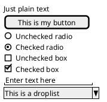

**Output**: Login form with various input types

---

### Grid Layout

#### Using `|` for Table/Grid

Use `|` to create columns in a grid layout.

**Basic Grid Example:**

```plantuml
@startsalt
{
  Login    | "MyName   "
  Password | "****     "
  [Cancel] | [  OK   ]
}
@endsalt
```

**Grid Modifiers** (placed after opening `{`):

| Modifier | Description | Example |
|----------|-------------|---------|
| `{` | No border | `{ Login \| "text" }` |
| `{#` | Display all borders | `{# Login \| "text" }` |
| `{!` | Display all outer borders | `{! Login \| "text" }` |
| `{-` | Dash border | `{- Login \| "text" }` |
| `{+` | Opening a new window | `{+ ... }` |

**Example with Borders:**

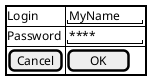

---

### Advanced Features

#### 1. Text Area (Multiline Input)

**Syntax:**
- Use `.` to fill vertical space
- Last line with spaces `"      "` to set width

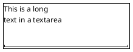

**With Scroll Bars:**

| Scroll Type | Syntax | Description |
|-------------|--------|-------------|
| Horizontal + Vertical | `{S` | Both scrollbars |
| Horizontal only | `{SI` | Horizontal bar |
| Vertical only | `{S-` | Vertical bar |

```plantuml
@startsalt
{SI
   This is a long
   text in a textarea
   .
   "                         "
}
@endsalt
```

---

#### 2. Group Box `{^"Title"`

Create grouped sections with titles:

```plantuml
@startsalt
{^"My group box"
  Login    | "MyName   "
  Password | "****     "
  [Cancel] | [  OK   ]
}
@endsalt
```

---

#### 3. Separators

Use different separators for visual division:

| Separator | Style |
|-----------|-------|
| `..` | Dotted line |
| `==` | Double line |
| `~~` | Wavy line |
| `--` | Dashed line |

**Example:**

```plantuml
@startsalt
{
  Text1
  ..
  "Some field"
  ==
  Note on usage
  ~~
  Another text
  --
  [Ok]
}
@endsalt
```

---

#### 4. Tree Widget `{T`

Create hierarchical tree structures with `+` notation:

```plantuml
@startsalt
{
{T
 + World
 ++ America
 +++ Canada
 +++ USA
 ++++ New York
 ++++ Boston
 +++ Mexico
 ++ Europe
 +++ Italy
 +++ Germany
 ++++ Berlin
}
}
@endsalt
```

**Levels:**
- `+` = Level 1
- `++` = Level 2
- `+++` = Level 3
- etc.

---

#### 5. Tabs `{/`

**Horizontal Tabs:**

```plantuml
@startsalt
{+
{/ <b>General | Fullscreen | Behavior | Saving }
{
  { Open image in: | ^Smart Mode^ }
  [X] Smooth images when zoomed
  [X] Confirm image deletion
  [ ] Show hidden images
}
[Close]
}
@endsalt
```

**Vertical Tabs:**

```plantuml
@startsalt
{+
{/ <b>General
Fullscreen
Behavior
Saving } |
{
  { Open image in: | ^Smart Mode^ }
  [X] Smooth images when zoomed
  [X] Confirm image deletion
  [ ] Show hidden images
  [Close]
}
}
@endsalt
```

---

#### 6. Menu `{*`

Create menu bars:

```plantuml
@startsalt
{+
{* File | Edit | Source | Refactor }
{/ General | Fullscreen | Behavior | Saving }
{
  { Open image in: | ^Smart Mode^ }
  [X] Smooth images when zoomed
  [X] Confirm image deletion
  [ ] Show hidden images
}
[Close]
}
@endsalt
```

**Open Menu Items:**

```plantuml
@startsalt
{+
{* File | Edit | Source | Refactor
 Refactor | New | Open | Save }
{/ General | Fullscreen | Behavior | Saving }
{
  { Open image in: | ^Smart Mode^ }
  [X] Smooth images when zoomed
}
[Close]
}
@endsalt
```

---

#### 7. Colors

Add colors to widgets using `<color:ColorName>` or `<color:#HexCode>`:

```plantuml
@startsalt
{
  <color:Blue>Just plain text
  [This is my default button]
  [<color:green>This is my green button]
  [<color:#9a9a9a>This is my disabled button]
  []  <color:red>Unchecked box
  [X] <color:green>Checked box
  "Enter text here   "
  ^This is a droplist^
  ^<color:#9a9a9a>This is a disabled droplist^
  ^<color:red>This is a red droplist^
}
@endsalt
```

**Supported Colors:**
- Named: `Blue`, `Red`, `Green`, `Yellow`, `Orange`, `Purple`
- Hex codes: `#9a9a9a`, `#ff0000`, `#00ff00`

---

### Salt Complete Example - Settings Dialog

```plantuml
@startsalt
{+
{* File | Edit | View | Help }
{/ <b>General | Display | Advanced | About }
==
{^"User Preferences"
  Username     | "admin       "
  Password     | "********    "
  Remember me  | [X]
}
--
{^"Display Options"
  Theme        | ^Dark Mode^^ Light^^ Auto^
  Font Size    | ^Medium^
  []  Enable animations
  [X] Show tooltips
  []  High contrast mode
}
==
{
  [Cancel] | [Apply] | [OK]
}
}
@endsalt
```

---

### Salt Quick Reference

#### Widget Cheat Sheet

```plantuml
@startsalt
{+
  == Basic Inputs ==
  [Button]
  () Radio | (X) Checked Radio
  [] Checkbox | [X] Checked Box
  "Text Input         "
  ^Dropdown^
  --
  == Grid Layout ==
  Label | Value
  Name  | "John"
  Age   | "25"
  ==
  == Tree ==
  {T
   + Root
   ++ Child 1
   ++ Child 2
  }
}
@endsalt
```

---

### Salt Best Practices

**1. Layout Structure:**
- Always enclose content in `{ }`
- Use `{+` for window with title bar
- Use `|` for column separation
- Use separators (`..`, `==`, `~~`, `--`) for sections

**2. Spacing:**
- Add spaces in text inputs `"text   "` to control width
- Use `.` for vertical spacing in text areas
- Leave blank lines for visual separation

**3. Nesting:**
- Nest `{ }` blocks for complex layouts
- Combine tabs `{/`, menus `{*`, and grids `{#`
- Group related elements in group boxes `{^"Title"`

**4. Mockup Fidelity:**
- **Low Fidelity**: Basic widgets, no colors
- **Medium Fidelity**: Add borders `{#`, separators, grouping
- **High Fidelity**: Add colors, tabs, menus, realistic content

---

### When to Use Salt vs Mermaid

| Feature | PlantUML Salt | Mermaid |
|---------|---------------|---------|
| **UI Mockups** | ✅ Excellent - Purpose-built | ❌ Not supported |
| **Wireframes** | ✅ Native support | ❌ Not supported |
| **Forms/Dialogs** | ✅ Built-in widgets | ❌ Not supported |
| **Flowcharts** | ❌ Not supported | ✅ Excellent |
| **Diagrams** | ⚠️ Limited (use PlantUML) | ✅ Excellent |
| **Syntax** | More verbose | Simpler |
| **Use Case** | UI/UX Design | Documentation, Flows |

**Recommendation:**
- **Salt**: For UI mockups, wireframes, form layouts, screen designs
- **Mermaid**: For flowcharts, sequence diagrams, ER diagrams, Gantt charts
- **PlantUML (non-Salt)**: For UML diagrams, class diagrams, component diagrams

---

### Salt Resources

**Documentation:**
- Official: https://plantuml.com/salt
- Examples: Use "Edit online" links on PlantUML website
- Test online: https://www.plantuml.com/plantuml/

**Export with Textor:**
```bash
# Export markdown with Salt diagrams to PDF
/home/fong/Projects/textor-doc-converter/run-807f321188c6.sh '{"command":"export-md-to-pdf","data":"your-mockup.md"}'
```

**Common Errors:**
1. Missing `{ }` enclosure → Always wrap in braces
2. Missing `@startsalt` / `@endsalt` → Required wrapper
3. Incorrect `|` spacing → Use spaces around `|` for alignment
4. Nested braces mismatch → Count opening/closing braces

---

## Important Notes

1. **Always use absolute path**: `/home/fong/Projects/textor-doc-converter/run-807f321188c6.sh`
2. **Examples are illustrative only** - Many more commands and options available
3. **Run `--help` for complete documentation** with all commands, parameters, and options
4. **Check logs**: `logs/debug.log` for detailed error information

### Mermaid vs PlantUML - Khi nào dùng gì?

| Criteria | Mermaid | PlantUML |
|----------|---------|----------|
| **Syntax** | Simple, readable | More verbose |
| **Rendering** | Client-side (JavaScript) | Server-side |
| **Best for** | Web docs, GitHub | Complex UML diagrams |
| **Learning curve** | Easy | Medium |
| **Flowcharts** | ✅ Excellent | ✅ Good |
| **Sequence** | ✅ Good | ✅ Excellent |
| **Class diagrams** | ✅ Good | ✅ Excellent |
| **ER diagrams** | ✅ Excellent | ⚠️ Limited |
| **Git graphs** | ✅ Native support | ❌ Not supported |
| **Use cases** | ✅ Native support | ✅ Excellent |
| **Gantt** | ✅ Good | ✅ Good |

**Recommendation:**
- **Mermaid**: Cho web documentation, GitHub README, simple diagrams
- **PlantUML**: Cho complex UML diagrams, detailed software architecture

---

## Quick Reference

### Reference Documentation Files

**Absolute Paths for Direct Reading:**

```bash
# PlantUML Salt Reference (UI Mockups & Wireframes)
cat /home/fong/Projects/textor-doc-converter/docs/plantuml-salt-reference.md

# Mermaid Reference (All 13 Diagram Types)
cat /home/fong/Projects/textor-doc-converter/docs/mermaid-reference.md

# Or use less for paginated reading
less /home/fong/Projects/textor-doc-converter/docs/plantuml-salt-reference.md
less /home/fong/Projects/textor-doc-converter/docs/mermaid-reference.md
```

**File Sizes:**
- `plantuml-salt-reference.md`: 6.9K (compact reference)
- `mermaid-reference.md`: 14K (comprehensive guide)

---

### Show Help
```bash
/home/fong/Projects/textor-doc-converter/run-807f321188c6.sh --help
```

### Test Files Available
```
tests/
├── test-mermaid.md          # Mermaid examples
├── test-plantuml-fail.md    # PlantUML error cases
├── plantuml-mermaid.md      # Mixed diagrams (PlantUML + Mermaid)
├── mermaid-all-types.md     # All 13 Mermaid diagram types
```

### Quick Test
```bash
# Test mixed diagrams
/home/fong/Projects/textor-doc-converter/run-807f321188c6.sh '{"command":"export-md-to-pdf","data":"tests/plantuml-mermaid.md"}'

# Test all Mermaid types
/home/fong/Projects/textor-doc-converter/run-807f321188c6.sh '{"command":"export-md-to-pdf","data":"tests/mermaid-all-types.md"}'
```

### Mermaid Code Block Format

```markdown
```mermaid
flowchart TD
    A --> B
```
```

### PlantUML Code Block Format

```markdown
```plantuml
@startuml
Alice -> Bob
@enduml
```
```

### PlantUML Salt Code Block Format

```markdown
```plantuml
@startsalt
{
  Username | "admin   "
  Password | "****    "
  [Cancel] | [OK]
}
@endsalt
```
```

---

## Alternative: Direct Pandoc with XeLaTeX (No Diagrams)

**Use Case**: Khi file .md **KHÔNG có** Mermaid hoặc PlantUML diagrams, có thể dùng Pandoc trực tiếp với xelatex engine.

### When to Use

✅ **Dùng XeLaTeX khi:**
- File .md không có code blocks: `````mermaid` hoặc `````plantuml`
- Chỉ có text, headings, images, tables, code blocks thông thường
- Cần convert nhanh không cần validate diagrams
- File có ảnh embedded (JPEG, PNG) - xelatex handle rất tốt

❌ **KHÔNG dùng XeLaTeX khi:**
- File có Mermaid diagrams → Dùng Textor Doc Converter
- File có PlantUML diagrams → Dùng Textor Doc Converter
- File có mixed diagrams → Dùng Textor Doc Converter

### Command Pattern

```bash
cd /path/to/directory

pandoc input-file.md \
  -o output-file.pdf \
  --pdf-engine=xelatex \
  -V geometry:margin=1in \
  -V fontsize=11pt \
  --toc
```

### Real Example

```bash
# Example: Convert changelog with images
cd /home/fong/Projects/de/public/CHANGELOGS

pandoc CHANGELOG-2025-10-23_15-55-Claude.md \
  -o CHANGELOG-2025-10-23_15-55-Claude.pdf \
  --pdf-engine=xelatex \
  -V geometry:margin=1in \
  -V fontsize=11pt \
  --toc
```

**Result**: 191KB PDF with 4 embedded JPEG images (11 pages)

### Options Explained

| Option | Purpose |
|--------|---------|
| `--pdf-engine=xelatex` | Unicode support, handles images well |
| `-V geometry:margin=1in` | Set margins to 1 inch |
| `-V fontsize=11pt` | Base font size 11pt |
| `--toc` | Generate Table of Contents |

### Expected Warnings

⚠️ **Normal warnings** (can ignore):
```
[WARNING] Missing character: There is no ✅ (U+2705) in font...
[WARNING] Missing character: There is no 🎯 (U+1F3AF) in font...
```
- Emojis not in default font (cosmetic only)
- PDF still generates successfully
- Text content and images unaffected

### Comparison: Textor vs XeLaTeX

| Feature | Textor Doc Converter | Direct XeLaTeX |
|---------|---------------------|----------------|
| Mermaid support | ✅ Yes | ❌ No |
| PlantUML support | ✅ Yes | ❌ No |
| Images (JPEG/PNG) | ✅ Yes | ✅ Yes |
| Tables | ✅ Yes | ✅ Yes |
| Code blocks | ✅ Yes | ✅ Yes |
| Validation | ✅ Real errors | ❌ None |
| Speed | 🟡 Medium | 🟢 Fast |
| Use when | Has diagrams | No diagrams |

---

## Version History

### v2.2.0 (2025-10-30)
- ✅ Added alternative XeLaTeX section for files without diagrams
- ✅ Real example with changelog + images (191KB, 11 pages)
- ✅ Comparison table: Textor vs XeLaTeX
- ✅ When to use guide: Mermaid/PlantUML vs plain markdown

### v2.1.0 (2025-10-22)
- ✅ Added PlantUML Salt section for UI Mockups & Wireframes
- ✅ Complete widget reference (buttons, radios, checkboxes, text inputs, droplists)
- ✅ Grid layout with borders (`{#`, `{!`, `{-`)
- ✅ Advanced features: tabs, menus, tree widgets, scroll bars
- ✅ Colors and styling support
- ✅ Best practices and Salt vs Mermaid comparison
- ✅ Complete working examples for forms, dialogs, settings panels

### v2.0.0 (2025-10-22)
- ✅ Mermaid diagrams support (13 types)
- ✅ PlantUML diagrams support (11 types)
- ✅ Mixed diagrams in same document
- ✅ Export to PDF with embedded diagrams

---

**Last Updated**: 2025-10-30
**Version**: 2.2.0 - XeLaTeX Alternative for No-Diagram Files
