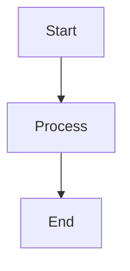

> **Purpose**: [Brief description of this document's purpose]

> **Context**: [Relevant background information or constraints]

---

## Overview

[High-level summary of what this document covers]

---

## Section 1: [Main Topic]

### Subsection 1.1: [Specific Aspect]

[Content here...]

### Subsection 1.2: [Another Aspect]

[Content here...]

---

## Section 2: [Another Main Topic]

### Subsection 2.1: [Details]

[Content here...]

### Subsection 2.2: [More Details]

[Content here...]

---

## Diagrams (Optional)

---

## Appendix — References

### Sources
- [Source 1]: [Description or citation]
- [Source 2]: [Description or citation]

### Related Documentation
- [Link to related doc 1]
- [Link to related doc 2]

---

## Stateless Micro-Task Template (WBS-XX)

> Use this template when decomposing work into WBS micro-tasks

### WBS-XX: [Micro-Task Title]

**Date Created**: YYYY-MM-DD
**Phase**: [Research | Design | Implementation | Verification]
**Parent Task**: [Link to parent WBS or main task]
**Status**: [Pending | In Progress | Completed | Blocked]

#### Context
- Brief description of what needs to be done.
- Why this task exists (link to parent objective).

#### Prerequisites
- List of required tools/files/information (must be absolute paths or explicit commands).
- Example: `.fong/instructions/init-prompt.json`, `mcp__ts-mem0-mcp__searchMemories`

#### Input
- Explicit input data or parameters needed.
- Example: `pattern: "search term"`, `path: "/absolute/path/to/directory"`

#### Output
- Expected deliverable (file path, data structure, or state change).
- Example: "File `/path/to/file.md` updated with new section (lines 100-150)."

#### Tools
- Mandatory tools for this task.
- Example: `smart-search`, `mem0 curl`, `tree`, `Read`, `Edit`

#### Verification Criteria
- How to verify success (checklist or test commands).
- Example:
  - [ ] File exists and contains expected content
  - [ ] All tests pass
  - [ ] No syntax errors

#### Execution Steps
1. Step-by-step instructions (self-contained, no external context needed).
2. Each step must be verifiable.
3. Include explicit commands or tool invocations.

#### Rollback Plan
- How to undo changes if task fails.
- Example: `git checkout HEAD -- path/to/file.md`

---

**Maintenance Notes**:
- Update version in YAML front matter when making significant changes.
- Keep structure DRY: Define once, reuse across similar documents.
- Always validate Mermaid diagrams before committing (if using Textor converter).
