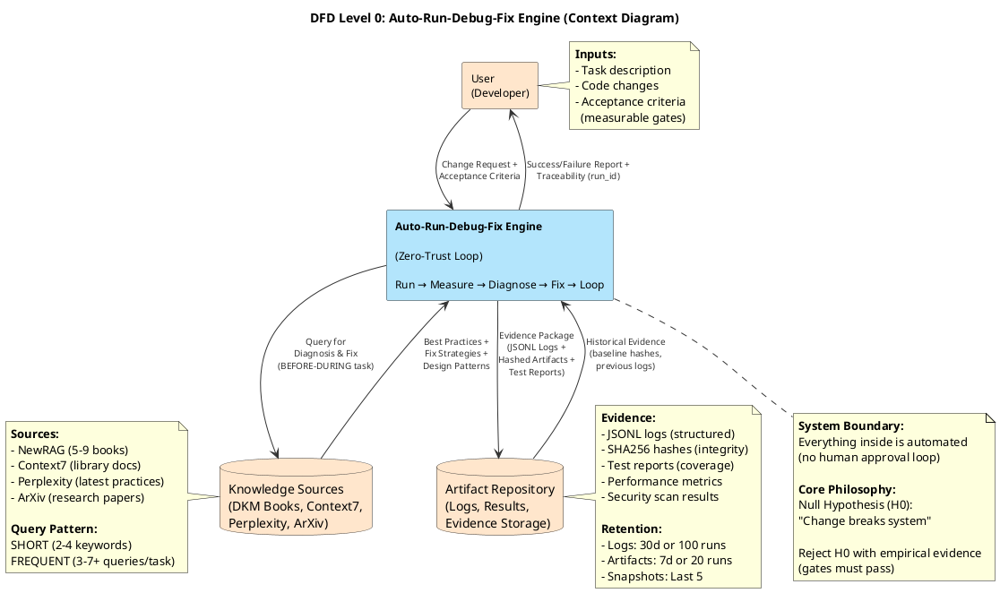
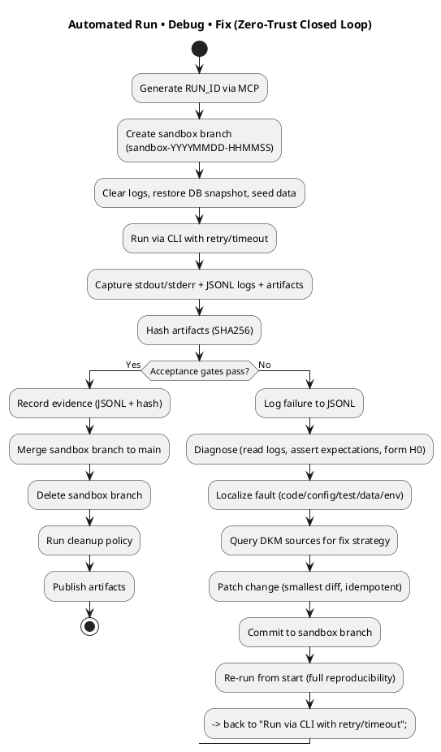

## Purpose

Establish a disciplined, reproducible, CLI-only **philosophy** ensuring every change (feature or bug fix) can be:
- **Executed automatically** (no manual intervention)
- **Observed objectively** (structured evidence)
- **Diagnosed deterministically** (root cause analysis)
- **Corrected through closed feedback loop** (auto-fix until success)

**Core Principle**: *"Prove yourself wrong before claiming you're right"* - Null hypothesis mindset applied to software engineering.

## Core References (SSoT - DO NOT DUPLICATE)

**MANDATORY READS:**
- `.fong/instructions/init-prompt.json` - Core principles, MCP priority, autonomous automation (lines 25-31), safe-calculation rules
- `.fong/instructions/mindset-proof-by-contradiction-null-hypothesis-adversarial-validation-red-team-exploratory-testing.md` - H0/Adversarial mindset
- `.fong/instructions/fongtools.json` - Tool catalog (MCP servers, fallbacks)
- `.fong/instructions/instructions-dkm-sources-knowledgebase.md` - Knowledge source query strategies

## Mindset & Philosophy

### Zero-Trust Principle
**Assumption**: Every change is GUILTY (breaks system) until proven INNOCENT (passes all gates).

**Consequences**:
- No human "I think it works" claims allowed
- Only empirical evidence (logs, tests, metrics) accepted
- Automation runs validation gates without asking permission
- Failure triggers auto-debug loop (not manual investigation)

### Null Hypothesis Framing
For every change, explicitly state:
- **H0 (Null Hypothesis)**: "This change breaks correctness/performance/security"
- **H1 (Alternative)**: "This change improves system"
- **Evidence Required**: Measurable acceptance gates MUST pass to reject H0

### Closed-Loop Automation
**Philosophy**: Machine validates machine - no human approval in loop until final success.

**Loop**: Run → Measure → Diagnose → Fix → Run → ... → Success

**Anti-pattern**: Run → Wait for human → Human debugs → Human fixes → Hope it works

## DFD Level 0 (Context Diagram)

**External Entities**:
- User (provides task/change request)
- Knowledge Sources (DKM books, Context7, Perplexity)
- Artifact Repository (logs, results, evidence storage)

**System Boundary**: Auto-Run-Debug-Fix Engine

**Data Flows**:
- Input: Change Request + Acceptance Criteria
- Output: Evidence Package (logs, test reports, artifacts with hashes)



## Closed Loop Detail (Activity Diagram)

**Loop Flow**: Run → Measure → Diagnose → Fix → Loop (until success)



**Key Loop Properties**:
- **Automatic**: No human approval required in loop
- **Deterministic**: Each iteration starts from clean state
- **Traceable**: All iterations share same run_id
- **Convergent**: Loop terminates when gates pass OR max iterations reached

## Guardrails Concepts (No Code - Principles Only)

### 1. Sandbox Isolation
**Concept**: Every run operates in isolated git branch - rollback possible at any time.

**Git Workflow (MANDATORY)**:

1. **Save Current State FIRST** (before creating sandbox)
   ```
   git add -A
   git commit -m "checkpoint: save state before sandbox"
   git push origin main
   ```
   → This ensures you can always rollback to this point

2. **Create Sandbox Branch**
   ```
   BRANCH_NAME="sandbox-$(date +%Y%m%d-%H%M%S)"
   git checkout -b "$BRANCH_NAME"
   ```
   → Example: `sandbox-20251110-143025`

3. **Work in Sandbox** (all changes isolated)
   - Run tests, make fixes, iterate in loop
   - Multiple commits allowed in sandbox
   - Main branch stays clean

4. **Merge on Success** (gates pass)
   ```
   git checkout main
   git merge "$BRANCH_NAME" --no-ff -m "feat: success from $BRANCH_NAME"
   git branch -d "$BRANCH_NAME"
   git push origin main
   ```

5. **Rollback on Failure** (gates fail after max retries)
   ```
   git checkout main
   git branch -D "$BRANCH_NAME"  # Force delete failed branch
   ```
   → Main branch unchanged, can retry from checkpoint

**Key Properties**:
- **Pre-checkpoint**: ALWAYS save state before creating sandbox
- **Temporal naming**: Branch named with timestamp
- **Isolation**: Changes don't affect main until gates pass
- **Merge-on-success**: Branch merged to main ONLY after all gates pass
- **Force-delete-on-failure**: Failed branches cleaned up
- **Cleanup policy**: Old sandbox branches (>24h) auto-deleted

### 2. Traceability
**Concept**: Every run has unique identifier (UUID) - all artifacts tagged with run_id.

**Key Properties**:
- **UUID generation**: Via Safe Calculation MCP (or uuidgen fallback)
- **Prefix all logs**: `[$RUN_ID] log message`
- **Artifact naming**: `output-${RUN_ID}.json`
- **Cross-session tracking**: Can trace back any artifact to specific run

### 3. Structured Evidence
**Concept**: Logs follow machine-readable schema (JSONL) - no unstructured text logs.

**Schema Components**:
- Timestamp (ISO8601 with milliseconds)
- Run ID (UUID)
- Step (init|setup|test|build|deploy|cleanup)
- Level (debug|info|warn|error|fatal)
- Message (concise description)
- Evidence URI (file:// or http:// to artifact)

**Benefits**:
- Queryable with jq/grep
- Parseable by monitoring tools
- Reproducible across runs
- Enables trend analysis

### 4. Artifact Integrity
**Concept**: All outputs hashed (SHA256) - detect drift between runs.

**Key Properties**:
- **Hash on generation**: Compute hash immediately after artifact created
- **Metadata storage**: Store hash + timestamp in `.meta.json` file
- **Verification**: Compare hashes between runs to detect changes
- **Baseline tracking**: Optional baseline hash for regression detection

### 5. Acceptance Gates
**Concept**: Pre-defined, measurable criteria - binary pass/fail decision.

**Examples**:
- Test coverage ≥ 80%
- All tests pass (100% pass rate)
- Zero errors/warnings in logs
- Performance threshold met (e.g., response time < 200ms)
- Security scan shows no high/critical vulnerabilities

**Anti-pattern**: Vague acceptance like "code looks good" or "seems to work"

### 6. Resilience Mechanisms
**Concept**: Handle transient failures gracefully - retry with backoff, timeout enforcement.

**Key Properties**:
- **Retry policy**: Max attempts (e.g., 3), exponential backoff (1s → 2s → 4s)
- **Timeout enforcement**: Per-operation timeout (e.g., tests: 5min, API calls: 10s)
- **Jitter**: Add randomness to prevent thundering herd
- **Circuit breaker**: Stop retrying if underlying service is down

### 7. Idempotency
**Concept**: Re-running same operation produces same result - no side effects.

**Requirements**:
- Database operations: UPSERT instead of INSERT
- File operations: Overwrite instead of append
- API calls: Use idempotency keys
- State cleanup: Reset to known state before each run

**Verification**: Run twice → compare artifacts → hashes must match

### 8. Determinism
**Concept**: Fix randomness sources - ensure reproducibility across runs.

**Sources of non-determinism**:
- Random number generators (fix seed)
- Timestamps (use fixed timestamps in test data)
- Database state (snapshot + restore)
- Async operations (serialize or mock)

### 9. Retention Policy
**Concept**: Prevent log/artifact accumulation - automatic cleanup with retention rules.

**Policies**:
- Logs: Keep last 30 days OR last 100 runs (whichever is more)
- Artifacts: Keep last 7 days OR last 20 runs
- Sandbox branches: Delete after merge OR after 24 hours
- DB snapshots: Keep last 5 snapshots

### 10. Tool Discipline
**Concept**: MCP tools FIRST - never use inferior alternatives without trying MCP.

**Priority Order** (from init-prompt.json):
1. Smart Search (MCP or smart-search-fz-rg-bm25) - NOT grep
2. Tree (for directory listing) - NOT ls
3. Safe Calculation MCP - NEVER mental arithmetic
4. mem0 MCP - ALWAYS for memory operations
5. DKM sources - ALWAYS query before/during task execution

## Closed Loop Logic (Pseudocode)

```
FUNCTION auto_run_debug_fix(change_request, acceptance_criteria):
    // Phase 1: Setup
    run_id ← generate_uuid_via_mcp()
    sandbox_branch ← create_sandbox_branch(timestamp=now())
    checkout(sandbox_branch)
    clear_logs()
    snapshot ← create_db_snapshot(run_id)
    apply_deterministic_seed(seed=42)

    // Phase 2: Execution Loop
    WHILE true:
        // Run
        result ← execute_via_cli(change_request, timeout=MAX_TIMEOUT)
        capture_logs(run_id, result.stdout, result.stderr)
        artifacts ← generate_artifacts(result)
        hashes ← hash_artifacts(artifacts, algo=SHA256)

        // Evaluate
        gates_result ← evaluate_acceptance_gates(acceptance_criteria, artifacts, logs)
        log_jsonl(run_id, "gates", gates_result.level, gates_result.message)

        // Decision
        IF gates_result.passed:
            // Success path
            record_evidence(run_id, artifacts, hashes, logs)
            checkout(main)
            merge(sandbox_branch, no_ff=true, message="feat: success from run {run_id}")
            delete_branch(sandbox_branch)
            cleanup_old_artifacts(retention_policy)
            RETURN success(evidence_package)
        ELSE:
            // Failure path - Auto-debug
            log_jsonl(run_id, "debug", "error", "Acceptance gates failed, analyzing...")

            // Root cause analysis
            errors ← extract_errors_from_logs(run_id)
            failure_domain ← classify_failure(errors)  // data|config|code|test|environment

            // Query knowledge sources for fix strategy
            fix_strategy ← query_dkm_newrag(keywords=[failure_domain, error_pattern])

            // Apply minimal fix
            patch ← generate_minimal_patch(fix_strategy, errors)
            apply_patch(patch)
            commit(sandbox_branch, message="fix: address {failure_domain} from run {run_id}")

            // Loop back - full reproducibility
            log_jsonl(run_id, "loop", "info", "Re-running after fix...")
            // Continue while loop - next iteration will re-run from clean state
    END WHILE
END FUNCTION
```

## Workflow Sequence (Abstract Steps)

1. **Initialize**
   - Generate run_id (UUID)
   - Create isolated sandbox branch
   - Reset environment to known state (clear logs, restore DB snapshot, apply seed)

2. **Execute**
   - Run change via CLI (with timeout)
   - Capture ALL outputs (stdout, stderr, logs, artifacts)
   - Tag everything with run_id

3. **Measure**
   - Hash all artifacts (SHA256)
   - Evaluate acceptance gates (quantitative criteria)
   - Store evidence (JSONL logs + hashed artifacts)

4. **Decide**
   - IF gates pass → Success (go to step 6)
   - IF gates fail → Diagnose (go to step 5)

5. **Diagnose & Fix**
   - Extract errors from logs
   - Classify failure domain (data/config/code/test/env)
   - Query DKM knowledge sources for fix strategy
   - Apply minimal patch
   - Commit fix to sandbox branch
   - → Loop back to step 2 (full re-run)

6. **Finalize**
   - Merge sandbox branch to main
   - Delete sandbox branch
   - Run cleanup policy (retention rules)
   - Publish evidence package

## Mapping to H0/Adversarial/Red Team Mindset

**Null Hypothesis (H0)**:
- State: "This change degrades system correctness/performance/security"
- Requirement: Empirical evidence MUST reject H0 before accepting change
- Gates: Measurable criteria that falsify H0

**Proof by Contradiction**:
- Search: Intentionally seek counterexamples (edge cases, boundary conditions)
- Discovery: If counterexample found → fix + encode as test
- Iteration: Repeat until no more counterexamples found

**Adversarial Testing**:
- Fuzzing: Generate random/invalid inputs
- Stress: Push system to limits (high load, timeouts, retries)
- Boundary: Test edge cases (empty inputs, max values, null)

**Red Team**:
- Attack: Try to break system with malicious inputs
- Exploit: Test known vulnerability patterns
- Defense: Verify security controls (auth, encryption, validation)

**Exploratory Testing**:
- Mine: Analyze logs for anomalies ("code smells")
- Discover: Find unexpected behaviors
- Encode: Convert discoveries into repeatable tests

**Reference**: See `.fong/instructions/mindset-proof-by-contradiction-null-hypothesis-adversarial-validation-red-team-exploratory-testing.md`

## Research via DKM Knowledge Sources (MANDATORY)

**Philosophy**: Never assume - always consult expert sources before/during work.

**Query Strategy** (from init-prompt.json):
- **BEFORE**: Query for approach/design patterns (planning phase)
- **DURING**: Query for validation/best practices (implementation phase)
- **AFTER**: Query for review checklist (verification phase)

**Source Priority**:
1. **Context7** - Library/framework API docs (ALWAYS FIRST for external libraries)
2. **NewRAG Multi-Query** - Select 5-9 books by hash ID (list PDFs first with `--list-pdfs`)
3. **Perplexity** - Latest practices from internet
4. **ArXiv** - Academic research for novel problems

**Query Pattern**:
- Use SHORT (2-4 keywords), FREQUENT queries (3-7+ per task is NORMAL)
- Examples: "error handling patterns", "retry backoff", "acceptance testing"

**Reference**: See `.fong/instructions/instructions-dkm-sources-knowledgebase.md`

## Technology-Agnostic Patterns

**Note**: This document describes CONCEPTS, not stack-specific implementations.

**Adaptation Required**:
- Use DKM knowledge sources to derive precise workflows for your project
- Translate concepts to your stack (Python/Node.js/PHP/etc.)
- Maintain CLI-only discipline regardless of stack
- Ensure logs/artifacts follow structured schema (JSONL)

**Key Invariants** (apply to ALL stacks):
- Sandbox isolation (git branches or equivalent)
- Structured logging (JSONL or equivalent)
- Artifact hashing (SHA256 or stronger)
- Acceptance gates (measurable, quantitative)
- Closed-loop automation (no human approval in loop)

## Operational Examples (Illustrative Only)

**UUID Generation**:
```
run_id ← mcp__safe-calculation__calculate(operation='uuid')
// Fallback: run_id ← system_command('uuidgen')
```

**Log Entry**:
```
log_entry ← {
  ts: current_timestamp_iso8601(),
  run_id: run_id,
  step: "test",
  level: "info",
  message: "All tests passed",
  evidence_uri: "file:///logs/pytest-{run_id}.log"
}
append_jsonl(log_entry, "logs/run-{run_id}.jsonl")
```

**Artifact Hashing**:
```
artifact ← "results/output-{run_id}.json"
hash ← sha256(artifact)
metadata ← {run_id: run_id, artifact: artifact, hash: hash, timestamp: now()}
write_json(metadata, "results/output-{run_id}.meta.json")
```

**Acceptance Gate**:
```
coverage ← parse_coverage_report("coverage.xml")
IF coverage >= 80%:
    gate_passed ← true
ELSE:
    gate_passed ← false
    log_error("Coverage {coverage}% below threshold 80%")
```

## Mindset Checklist (Apply Each Iteration)

- [ ] **Reference init-prompt.json** for core principles (SSoT/DRY/SOLID/MCP priority)
- [ ] **Null hypothesis stated** explicitly ("This change breaks X")
- [ ] **Sandbox branch** created (isolated from main)
- [ ] **Run ID** generated via Safe Calculation MCP
- [ ] **JSONL logs** follow schema (ts, run_id, step, level, message, evidence_uri)
- [ ] **Artifacts hashed** (SHA256) and metadata stored
- [ ] **Acceptance gates** defined BEFORE run (measurable, quantitative)
- [ ] **Retry/timeout** policy applied for resilience
- [ ] **Idempotency** verified (re-run produces same result)
- [ ] **Determinism** enforced (fixed seed, timestamps, DB snapshot)
- [ ] **MCP tools used FIRST** (smart-search, tree, mem0, safe-calculation)
- [ ] **DKM queried BEFORE-DURING** task execution (3-7+ queries per task)
- [ ] **Failure domain** classified before fixing (data/config/code/test/env)
- [ ] **Patch minimized** (smallest diff) and committed to sandbox
- [ ] **Re-run validates** fix (full reproducibility)
- [ ] **Evidence archived** (JSONL log, artifact hash, test report)
- [ ] **New test added** for any discovered counterexample
- [ ] **Sandbox merged** to main after success (or deleted after rollback)
- [ ] **Cleanup policy** executed (retention rules applied)

## Philosophical Summary

**Core Belief**: Reproducibility precedes interpretation.

**Evidence Layer**: Logs & artifacts are authoritative truth - not human memory/intuition.

**Validation Strategy**: Prove yourself wrong repeatedly until you can't anymore - then you're probably right.

**Automation Discipline**: CLI-only, no GUI dependence, full automation from run to fix to validation.

**Knowledge Grounding**: Never assume - always query DKM sources before/during work (80-90% of time).

**Result**: High-confidence changes with full traceability and reproducible evidence.
