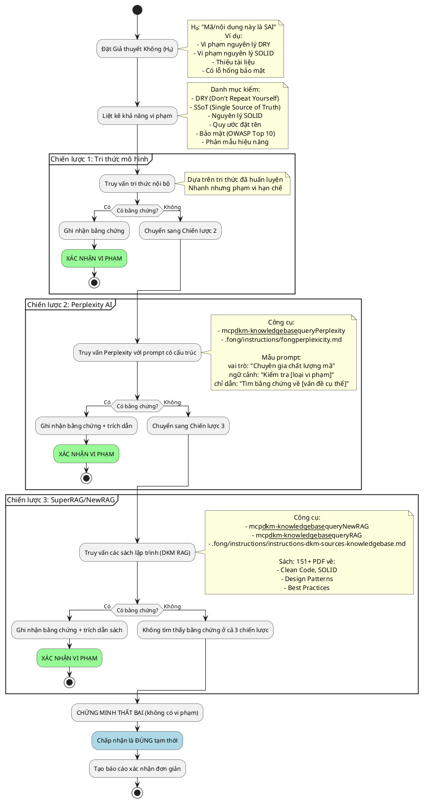

## Triết lý (tư duy cốt lõi)


> Không tin cậy mặc định (Zero Trust): "Giả định là SAI và tìm cách chứng minh. Nếu không thể chứng minh là sai, nhiều khả năng là ĐÚNG."


---


## Hướng dẫn đọc


Tệp dài (~667 dòng). Khuyến nghị đọc theo cửa sổ trượt: dùng `sed -n "N,M+33p" file` (các cửa sổ ~5%) hoặc `grep -A 20 "##"` hay `awk '/^## Bắt đầu/,/^## Kết thúc/'` để trích từng phần.


---


## Yêu cầu ngôn ngữ


Phản hồi bằng tiếng Việt chuẩn xác, học thuật. Tất cả báo cáo, phân tích và trao đổi theo phương pháp này MẶC ĐỊNH dùng tiếng Việt, trừ khi người dùng yêu cầu ngôn ngữ khác.


---


## Tổng quan phương pháp


- Nguyên lý cốt lõi: Luôn giả định Giả thuyết Không (H₀: "Nội dung/đối tượng đang xét là SAI") và tiếp cận có hệ thống để bác bỏ.
- Kết quả mong đợi:
  - Nếu chứng minh thành công (tìm thấy vi phạm) → Báo cáo chi tiết kèm trích dẫn.
  - Nếu chứng minh thất bại (không tìm thấy vi phạm) → Tạm chấp nhận là đúng, lập báo cáo tóm tắt.
- Tình huống áp dụng: xác nhận chất lượng mã, nội dung, kiến trúc, bảo mật, kiểm thử.


---


## Tư duy cốt lõi: Đối kháng có hệ thống


### Đóng vai phản biện (Devil's Advocate)


> “Bi kịch lớn của khoa học là cái chết của một giả thuyết đẹp bởi một sự thật xấu xí.” — Thomas Huxley


Ba câu hỏi nền tảng:

1. Có thể SAI ở đâu?
   - Liệt kê các khả năng vi phạm (DRY, SSoT, SOLID, đặt tên, bảo mật, hiệu năng...). Ví dụ: “Phần này lặp lại nội dung X → vi phạm DRY”.

2. Tôi có thể CHỨNG MINH nó sai không?
   - Tìm chứng cứ theo ba chiến lược (dưới đây). Nguồn: tri thức mô hình, Perplexity AI, RAG sách chuyên khảo.

3. Nếu không chứng minh được là sai, liệu có thể tạm coi là ĐÚNG?
   - Thiếu bằng chứng ≠ bằng chứng của sự vắng mặt; nhưng là chỉ báo mạnh. Ghi lại những gì đã kiểm tra và lý do không phát hiện vi phạm.


---


## Thuật ngữ chính thức và phương pháp liên quan


| Phương pháp | Miền | Mô tả | Khi nên dùng |
|-------------|------|-------|--------------|
| Chứng minh phản chứng (Reductio ad Absurdum) | Toán/Logic | Giả định phủ định điều cần chứng minh, suy ra mâu thuẫn | Kiểm định logic/nội dung |
| Kiểm định Giả thuyết Không | Khoa học | Giả định H₀ (không hiệu ứng/không vi phạm), tìm bằng chứng để bác bỏ | Kiểm định thống kê |
| Xác minh đối kháng (Adversarial Validation) | Phần mềm/ML | Thiết kế đầu vào/thử nghiệm để bộc lộ lỗi | Chất lượng mã, mô hình ML |
| Tư duy Red Team | Bảo mật/QA | Nhập vai kẻ tấn công để thử độ bền vững | Kiểm toán bảo mật |
| Kiểm thử thăm dò | QA phần mềm | Giả định có lỗi; khám phá có hệ thống | Kiểm thử thủ công |

Nguồn tham khảo tiêu biểu:
- Paul Butcher (2009), Debug It! — phương pháp khoa học trong gỡ lỗi.
- Hall et al. (2023), Machine Learning for High-Risk Applications — xác minh đối kháng.
- Tài liệu hệ thống ML (2025) — phương pháp kiểm thử đối kháng.


---


## Quy trình





---


## Chiến lược chứng minh (3 cấp)


### Chiến lược 1: Tri thức mô hình (nhanh)


- Khi dùng: cần kiểm tra nhanh các mẫu phổ biến.
- Cách làm:
```bash
# Lập luận nội bộ dựa trên tri thức đã huấn luyện
# Không cần gọi công cụ
# Ví dụ: "Nội dung này lặp đoạn X hai lần → vi phạm DRY"
```
- Hạn chế: mốc cắt tri thức; có thể bỏ sót quy tắc chuyên biệt; không có trích dẫn.
- Khuyến nghị: dùng như bước sàng lọc ban đầu trước khi đào sâu.


---


### Chiến lược 2: Perplexity AI (thực hành mới nhất)


- Khi dùng: cần thực hành/best practices mới nhất, tìm kiếm trên Internet.
- Công cụ:
  - `mcp__dkm-knowledgebase__queryPerplexity` (MCP)
  - `.fong/instructions/fongperplexicity.md` (dự phòng)
- Mẫu prompt có cấu trúc:

```python
{
  "role": "Chuyên gia Đảm bảo Chất lượng Phần mềm",
  "context": "Thẩm định [tệp/mã] về [loại vi phạm: DRY, SOLID,...]",
  "instructions": [
    "1. Kiểm xem [mẫu cụ thể] có vi phạm [nguyên lý] không",
    "2. Tìm nguồn có thẩm quyền (sách, bài báo, tiêu chuẩn)",
    "3. Nêu ví dụ cụ thể của vi phạm",
    "4. Trích nguồn với tác giả, năm, số trang"
  ],
  "output_format": "Báo cáo có cấu trúc: Có/Không, Bằng chứng, Trích dẫn",
  "cautions": [
    "Tập trung vi phạm thực tiễn, tránh biên xa lý thuyết",
    "Ưu tiên nguồn có thẩm quyền (peer-reviewed, tiêu chuẩn công nghiệp)"
  ],
  "question": "[đoạn mã/mẫu] có vi phạm [nguyên lý] không? Cung cấp bằng chứng."
}
```

Ví dụ dùng:

```bash
# Kiểm tra vi phạm DRY
mcp__dkm-knowledgebase__queryPerplexity \
  --role "Chuyên gia Clean Code" \
  --context "Tệp có 2 mục 'Pre-workflow' trùng tại dòng 424 và 426" \
  --instructions '["Kiểm tra vi phạm nguyên lý DRY", "Trích dẫn từ Clean Code"]' \
  --output_format "Có/Không + Bằng chứng + Trích dẫn" \
  --question "Trùng lặp này có vi phạm DRY không?"
```


---


### Chiến lược 3: SuperRAG/NewRAG (sách uy tín)


- Khi dùng: cần trích dẫn từ sách chuyên khảo/lĩnh vực, kiểm định kỹ thuật sâu.
- Công cụ:
  - `mcp__dkm-knowledgebase__queryNewRAG` (lọc theo hash, 151 sách)
  - `mcp__dkm-knowledgebase__queryRAG` (truy vấn rộng)
  - `.fong/instructions/instructions-dkm-sources-knowledgebase.md` (hướng dẫn)
- Quy trình NewRAG:

```bash
# Bước 1: Liệt kê sách sẵn có
/home/fong/Projects/mini-rag/multi-query/run-multiquery.sh --list-pdfs

# Bước 2: Chọn sách liên quan (5–9 cuốn)
# Ví dụ: Clean Code, SOLID, Design Patterns

# Bước 3: Truy vấn đa từ khóa
mcp__dkm-knowledgebase__queryNewRAG \
  --queries '["DRY principle violation", "duplicate code smell"]' \
  --source_hashes "hash1,hash2,hash3"
```

- QueryRAG (nhanh hơn, phạm vi rộng):

```bash
mcp__dkm-knowledgebase__queryRAG \
  --question "DRY principle duplicate sections" \
  --top_k 5
```

- Nhóm sách tiêu biểu (151+ PDF): Clean Code; SOLID; Design Patterns; Refactoring; Code Smells.


---


## Mẫu báo cáo


### Mẫu 1: PHÁT HIỆN VI PHẠM (báo cáo chi tiết)


```markdown
# Báo cáo Xác minh Đối kháng

**Ngày**: YYYY-MM-DD


**Đối tượng**: [tên tệp hoặc đoạn mã]


**Giả thuyết**: H₀: "Sai" (giả định vi phạm [nguyên lý])


**Kết quả**: VI PHẠM ĐƯỢC XÁC NHẬN


---


## 1. Sai ở đâu?


**Loại vi phạm**: [DRY / SOLID / SSoT / Bảo mật / ...]


**Vấn đề cụ thể**:
- Vị trí: Dòng X–Y, Mục Z
- Vấn đề: Nội dung trùng lặp / Thiếu trừu tượng hóa / ...
- Tác động: Gánh nặng bảo trì, gây nhiễu, nợ kỹ thuật


**Bằng chứng**:
```
[Trích chính xác phần vi phạm]
```


---


## 2. Vì sao là sai?


**Nguyên lý bị vi phạm**: [ví dụ, DRY]


**Định nghĩa có thẩm quyền**:
> "Mỗi đơn vị tri thức phải có một biểu diễn duy nhất, rõ ràng, có thẩm quyền trong hệ thống."
> — The Pragmatic Programmer (Hunt & Thomas, 1999)


**Giải thích**:
- [Vì sao mẫu cụ thể này vi phạm nguyên lý]
- [Hệ quả của vi phạm]


**Chiến lược chứng minh sử dụng**: [Tri thức mô hình / Perplexity / RAG]


**Trích dẫn**:
1. [Tác giả, Năm] — [Tên sách/bài], Trang X
2. [Nguồn 2]
3. [Nguồn 3]


---


## 3. Cách làm ĐÚNG?


**Giải pháp**:
- Trước (SAI):
  ```
  [Mã/nội dung hiện tại]
  ```

- Sau (ĐÚNG):
  ```
  [Phiên bản đã tái cấu trúc]
  ```


**Vì sao tốt hơn**:
- Một nguồn sự thật (SSoT)
- Dễ bảo trì
- Giảm trùng lặp


**Tham chiếu triển khai**:
- [Liên kết ví dụ hoặc mẫu]
- [Trích dẫn nguồn có thẩm quyền]


---


## 4. Đo lường tính đúng đắn


**Danh mục kiểm**:
- [ ] Không còn nội dung trùng lặp (grep, diff)
- [ ] SSoT (tất cả tham chiếu về một nơi)
- [ ] Điểm DRY: [chỉ số, ví dụ 0 dòng trùng]


**Kiểm tự động**:
```bash
# Lệnh xác minh
grep -n "mẫu trùng" file.md | wc -l  # Kỳ vọng 1 thay vì 2+
```


**Rà soát thủ công**:
- Code review: Tìm các trường hợp tương tự
- Tài liệu: Cập nhật liên quan


---


## 5. Cách sửa


Các bước:

1. Xác định tất cả bản trùng:
   ```bash
   grep -rn "nội dung trùng" .
   ```

2. Chọn vị trí chuẩn (SSoT):
   - Giữ: [Vị trí A — lý do]
   - Loại: [Vị trí B, C, D]

3. Tái cấu trúc:
   ```bash
   # Chỉnh sửa
   vim file.md +424  # Xóa bản trùng tại dòng 426
   ```

4. Xác minh:
   ```bash
   git diff file.md
   grep "trùng" file.md | wc -l
   ```

5. Commit mô tả rõ:
   ```bash
   git commit -m "fix(DRY): Loại bỏ mục Pre-workflow trùng (424/426); giữ 424 làm SSoT; trích Clean Code, Ch.17"
   ```
```


---


### Mẫu 2: KHÔNG PHÁT HIỆN VI PHẠM (báo cáo ngắn)


```markdown
# Báo cáo Xác minh Đối kháng

**Ngày**: YYYY-MM-DD


**Đối tượng**: [tên tệp hoặc đoạn mã]


**Giả thuyết**: H₀: "Sai" (giả định vi phạm [nguyên lý])


**Kết quả**: KHÔNG PHÁT HIỆN VI PHẠM (bác bỏ H₀)


---


## Tóm tắt xác minh


**Đã kiểm**:
- [x] DRY (trùng lặp nội dung)
- [x] SOLID (SRP, OCP, LSP, ISP, DIP)
- [x] SSoT (nhiều nguồn thẩm quyền)
- [x] Quy ước đặt tên
- [x] Bảo mật (OWASP Top 10)


**Chiến lược áp dụng**:
1. Tri thức mô hình — không thấy vi phạm
2. Perplexity AI — không có nguồn uy tín coi là vi phạm
3. RAG (151 sách) — không khớp mẫu mùi mã


**Kết luận**:
Mã/nội dung tuân thủ thực hành tốt. Không cần tái cấu trúc.


**Ngày xác minh**: YYYY-MM-DD HH:MM:SS


**Người xác minh**: [Tên]
```


---


## Mẫu trích dẫn


- Chứng minh phản chứng: “Áp dụng phương pháp reductio ad absurdum: giả định hệ thống sai, dẫn đến mâu thuẫn logic để chứng tỏ lập luận.”
- Giả thuyết Không: “Giả định không có vi phạm (H₀) và chủ động tìm bằng chứng để bác bỏ thông qua thăm dò có hệ thống.”
- Xác minh đối kháng: “Giả định mã vi phạm [nguyên lý], tạo ca kiểm để kích hoạt lỗi theo thực hành red team.”
- Định dạng trích sách: `[Tác giả, Năm] — [Nhan đề], [NXB], Trang [X]`.
  - Martin, R. C. (2008). Clean Code. Prentice Hall. Trang 289.
  - Fowler, M. (1999). Refactoring. Addison-Wesley. Trang 76.
  - Gamma, E. et al. (1994). Design Patterns. Addison-Wesley. Trang 151.


---


## Thực hành tốt (Best Practices)


### 1. Nêu giả định lỗi một cách minh thị


- Nên: Bắt đầu với H₀ rõ ràng; liệt kê khả năng vi phạm; ghi lại tiêu chí kiểm.
- Tránh: Mặc định đúng cho đến khi bị sai; bỏ qua kiểm tra có hệ thống; dựa vào cảm tính.


### 2. Khám phá có hệ thống (đủ 3 chiến lược)


- Nên: Đi từ nhanh đến sâu; ghi rõ chiến lược nào tìm thấy bằng chứng.
- Tránh: Dừng ở bước đầu; bỏ qua trích dẫn; chỉ dùng một nguồn tri thức.


### 3. Bằng chứng dựa trên trích dẫn


- Nên: Ưu tiên nguồn có thẩm quyền; kèm trang và trích dẫn nguyên văn khi cần.
- Tránh: Khẳng định mơ hồ; trích nguồn lỗi thời/thiếu thẩm quyền; thiếu gán nguồn.


### 4. Định lượng tính đúng đắn


- Nên: Đặt chỉ số rõ ràng; cung cấp lệnh kiểm tự động; có checklist rà soát.
- Tránh: Tiêu chí chủ quan; bỏ qua bước xác minh; chỉ nhìn bằng mắt.


### 5. Khuyến nghị sửa chữa khả thi


- Nên: Đưa các bước cụ thể; ví dụ trước/sau; giải thích vì sao tốt hơn.
- Tránh: Chỉ nêu vấn đề; hướng dẫn mơ hồ; không nêu lợi ích.


### 6. Tránh thiên kiến khẳng định


- Nên: Chủ động cố gắng BÁC BỎ tính đúng; kiểm tra biên; đặt câu hỏi về giả định.
- Tránh: Thiết kế kiểm chỉ để xác nhận; bỏ qua bằng chứng ngược; dừng khi thấy điều mong đợi.


### 7. Ghi nhận kết quả âm tính


- Nên: Báo cáo cả khi KHÔNG có vi phạm; liệt kê đã kiểm gì; giải thích vì sao mẫu chấp nhận được.
- Tránh: Chỉ báo cáo khi có lỗi; im lặng khi mọi thứ đúng; để tồn đọng nghi vấn.


---


## Tài liệu tham khảo


### Sách


1. Paul Butcher (2009). Debug It! Pragmatic Bookshelf — Chương: Phương pháp khoa học trong gỡ lỗi.
2. Hall, Curtis, Pandey (2023). Machine Learning for High-Risk Applications — Chương 3: Gỡ lỗi mô hình; xác minh đối kháng.
3. Robert C. Martin (2008). Clean Code: A Handbook of Agile Software Craftsmanship. Prentice Hall — Ch.17: Smells and Heuristics; mục Duplication.
4. Hunt & Thomas (1999). The Pragmatic Programmer. Addison-Wesley — DRY, Tính trực giao, SSoT.
5. Martin Fowler (1999). Refactoring. Addison-Wesley — Catalog code smells; Duplicated Code.


### Công cụ MCP liên quan


- DKM Knowledge Base MCP (`mcp__dkm-knowledgebase__*`):
  - `queryPerplexity` — thực hành mới nhất.
  - `queryNewRAG` — đa truy vấn có lọc sách.
  - `queryRAG` — truy vấn RAG tổng quát.


### Tệp hướng dẫn


- `.fong/instructions/fongperplexicity.md` — sử dụng Perplexity AI.
- `.fong/instructions/instructions-dkm-sources-knowledgebase.md` — bản đồ nguồn tri thức.
- `.fong/instructions/instructions-mem0.md` — căn chỉnh bộ nhớ.


---


Phiên bản: 1.0.1 — Cập nhật lần cuối: 2025-11-10 — Duy trì: Fong.


Tuyên ngôn: "Zero Trust — Giả định sai, chứng minh. Nếu không, tạm coi là đúng."
