# 🧠 PHILOSOPHY (Core Mindset)

> **ZERO TRUST! "Assume it's WRONG, prove it. If you can't, it's likely RIGHT."**

---

# ⚠️ READING INSTRUCTIONS

**File is long (667 lines). Use sliding window read: `sed -n "N,M+33p" file` (5% chunks) or `grep -A 20 "## Section"` or `awk '/^## Start/,/^## End/'`.**

---

# ⚠️ LANGUAGE REQUIREMENT

**Precise Vietnamese Response. Don't response in English.**

All reports, analysis, and communications using this methodology MUST be in Vietnamese unless explicitly requested otherwise by the user.

---

# Adversarial Validation & Null Hypothesis Testing Mindset

**Version**: 1.0.1
**Created**: 2025-11-10
**Updated**: 2025-11-10
**File**: `mindset-proof-by-contradiction-null-hypothesis-adversarial-validation-red-team-exploratory-testing.md`

---

## 📑 INDEX

- [🎯 Methodology Overview](#-methodology-overview)
- [🧠 Core Mindset](#-core-mindset-adversarial-thinking)
- [🔬 Formal Names & Related Approaches](#-formal-names--related-approaches)
- [📊 Workflow](#-workflow)
- [🛠️ Proof Strategies (3 Levels)](#️-proof-strategies-3-levels)
- [📝 Report Templates](#-report-templates)
- [📚 Citation Patterns](#-citation-patterns)
- [⚠️ Best Practices](#️-best-practices)
- [🔗 References](#-references)

---

## 🎯 Methodology Overview

**Core Principle**: **Assume the Null Hypothesis** (H₀: "This is WRONG") and systematically attempt to prove it.

**Outcome**:
- ✅ **Proof successful** (found violations) → Report detailed errors with citations
- ❌ **Proof failed** (no violations found) → Accept as correct, simple report

**Use Cases**:
- Code validation (DRY, SOLID, naming conventions)
- Content validation (SSoT, accuracy, completeness)
- Architecture validation (design patterns, best practices)
- Security validation (red team thinking)

---

## 🧠 Core Mindset: Adversarial Thinking

### The Devil's Advocate Approach

> "The great tragedy of Science—the slaying of a beautiful hypothesis by an ugly fact."
> — Thomas Huxley

**Three Fundamental Questions**:

1. **What could be WRONG?**
   - List all possible violations (DRY, SSoT, SOLID, naming, security, etc.)
   - Example: "This file violates DRY by duplicating section X"

2. **Can I PROVE it's wrong?**
   - Search for evidence using 3 strategies (see below)
   - Evidence sources: Model knowledge, Perplexity AI, RAG systems

3. **If I can't prove it's wrong, is it RIGHT?**
   - Absence of evidence ≠ evidence of absence (but strong indicator)
   - Document what was checked and why no violations were found

---

## 🔬 Formal Names & Related Approaches

| Methodology | Domain | Description | When to Use |
|-------------|--------|-------------|-------------|
| **Proof by Contradiction** (Reductio ad Absurdum) | Mathematics/Logic | Assume opposite of what you want to prove; derive contradiction | Logical code validation |
| **Null Hypothesis Testing** | Scientific Research | Assume H₀ (no effect/no violation); seek evidence to reject it | Statistical validation |
| **Adversarial Validation** | Software/ML | Design inputs/tests to expose failures | Code quality, ML models |
| **Red Team Thinking** | Security/QA | Adopt attacker's mindset to challenge robustness | Security audits |
| **Exploratory Testing** | Software QA | Assume system has bugs; explore systematically | Manual testing |

**Sources**:
- Debug It! Find, Repair, and Prevent Bugs in Your Code (Paul Butcher, 2009) - Scientific method in debugging
- Machine Learning for High-Risk Applications (Hall et al., 2023) - Adversarial validation
- Machine Learning Systems (2025) - Adversarial testing methodologies

---

## 📊 Workflow

```plantuml
@startuml
skinparam defaultTextAlignment center

start

:Define Null Hypothesis (H₀);
note right
  H₀: "This code/content is WRONG"
  Examples:
  - Violates DRY principle
  - Violates SOLID principle
  - Missing documentation
  - Security vulnerability
end note

:List Possible Violations;
note right
  Checklist:
  - DRY (Don't Repeat Yourself)
  - SSoT (Single Source of Truth)
  - SOLID principles
  - Naming conventions
  - Security (OWASP Top 10)
  - Performance anti-patterns
end note

partition "Proof Strategy 1: Model Knowledge" {
  :Query internal knowledge base;
  note right
    Use pre-trained knowledge
    Fast but limited scope
  end note

  if (Evidence found?) then (yes)
    :Document evidence;
    #palegreen:Violation CONFIRMED;
    stop
  else (no)
    :Move to Strategy 2;
  endif
}

partition "Proof Strategy 2: Perplexity AI" {
  :Query Perplexity with structured prompt;
  note right
    Tools:
    - mcp__dkm-knowledgebase__queryPerplexity
    - .fong/instructions/fongperplexicity.md

    Prompt template:
    role: "Code Quality Expert"
    context: "Checking for [violation type]"
    instructions: "Find evidence of [specific issue]"
  end note

  if (Evidence found?) then (yes)
    :Document evidence + citation;
    #palegreen:Violation CONFIRMED;
    stop
  else (no)
    :Move to Strategy 3;
  endif
}

partition "Proof Strategy 3: SuperRAG/NewRAG" {
  :Query programming books (DKM RAG);
  note right
    Tools:
    - mcp__dkm-knowledgebase__queryNewRAG
    - mcp__dkm-knowledgebase__queryRAG
    - .fong/instructions/instructions-dkm-sources-knowledgebase.md

    Books: 151+ PDFs on:
    - Clean Code, SOLID
    - Design Patterns
    - Best Practices
  end note

  if (Evidence found?) then (yes)
    :Document evidence + book citations;
    #palegreen:Violation CONFIRMED;
    stop
  else (no)
    :No evidence found in all 3 strategies;
  endif
}

:Proof FAILED (no violations found);
#lightblue:Accept as CORRECT;
:Generate simple validation report;

stop

@enduml
```



---

## 🛠️ Proof Strategies (3 Levels)

### Strategy 1: Model Knowledge (Fast)

**Use when**: Quick validation needed, common patterns

**How**:
```bash
# Internal reasoning based on training data
# No tool calls needed
# Example: "This violates DRY because section X appears twice"
```

**Limitations**:
- Knowledge cutoff date
- May miss domain-specific rules
- No citations

**When to use**: Initial quick check before deeper validation

---

### Strategy 2: Perplexity AI (Latest Practices)

**Use when**: Need latest best practices, internet research

**Tools**:
- `mcp__dkm-knowledgebase__queryPerplexity` (MCP)
- `.fong/instructions/fongperplexicity.md` (fallback)

**Structured Prompt Template**:

```python
{
  "role": "Software Quality Assurance Expert",
  "context": "Validating [file/code] for [violation type: DRY, SOLID, etc.]",
  "instructions": [
    "1. Check if [specific pattern] violates [principle]",
    "2. Find authoritative sources (books, papers, standards)",
    "3. Provide specific examples of violations",
    "4. Cite sources with author, year, page numbers"
  ],
  "output_format": "Structured report with: Violation found (yes/no), Evidence, Citation",
  "cautions": [
    "Focus on practical violations, not theoretical edge cases",
    "Prioritize authoritative sources (peer-reviewed, industry standards)"
  ],
  "question": "Does [this code/pattern] violate [principle]? Provide evidence."
}
```

**Example Usage**:

```bash
# Check DRY violation
mcp__dkm-knowledgebase__queryPerplexity \
  --role "Clean Code Expert" \
  --context "File has duplicate Pre-workflow sections at lines 424 and 426" \
  --instructions '["Check if this violates DRY principle", "Provide citation from Clean Code book"]' \
  --output_format "Yes/No + Evidence + Citation" \
  --question "Is duplicate section a DRY violation?"
```

---

### Strategy 3: SuperRAG/NewRAG (Authoritative Books)

**Use when**: Need citations from programming books, deep technical validation

**Tools**:
- `mcp__dkm-knowledgebase__queryNewRAG` (hash-filtered, 151 books)
- `mcp__dkm-knowledgebase__queryRAG` (general RAG)
- `.fong/instructions/instructions-dkm-sources-knowledgebase.md` (guide)

**NewRAG Workflow**:

```bash
# Step 1: List available books
/home/fong/Projects/mini-rag/multi-query/run-multiquery.sh --list-pdfs

# Step 2: Select relevant books (5-9 max)
# Example: Clean Code, SOLID, Design Patterns books

# Step 3: Query with multiple keywords
mcp__dkm-knowledgebase__queryNewRAG \
  --queries '["DRY principle violation", "duplicate code smell"]' \
  --source_hashes "hash1,hash2,hash3"  # From step 1
```

**QueryRAG (Quick Alternative)**:

```bash
# Query across all collections (faster, broader)
mcp__dkm-knowledgebase__queryRAG \
  --question "DRY principle duplicate sections" \
  --top_k 5
```

**Book Categories** (151+ PDFs):
- Clean Code: Robert C. Martin, Martin Fowler
- SOLID Principles: Agile Software Development
- Design Patterns: Gang of Four, Head First Design Patterns
- Refactoring: Martin Fowler
- Code Smells: Refactoring, Clean Code

---

## 📝 Report Templates

### Template 1: Violation FOUND (Detailed Report)

```markdown
# Adversarial Validation Report

**Date**: YYYY-MM-DD
**File/Code**: [filename or code snippet]
**Hypothesis**: H₀: "This is WRONG" (assumed violation of [principle])
**Result**: ✅ **VIOLATION CONFIRMED**

---

## 1. What is WRONG?

**Violation Type**: [DRY / SOLID / SSoT / Security / etc.]

**Specific Issue**:
- **Location**: Line X-Y, Section Z
- **Problem**: Duplicate content / Missing abstraction / etc.
- **Impact**: Maintenance burden, confusion, technical debt

**Evidence**:
```
[Exact code/content excerpt showing violation]
```

---

## 2. Why is it WRONG?

**Principle Violated**: [e.g., DRY - Don't Repeat Yourself]

**Authoritative Definition**:
> "Every piece of knowledge must have a single, unambiguous, authoritative representation within a system."
> — The Pragmatic Programmer (Hunt & Thomas, 1999)

**Explanation**:
- [Why this specific pattern violates the principle]
- [Consequences of this violation]

**Proof Strategy Used**: [Model Knowledge / Perplexity / RAG]

**Citations**:
1. [Author, Year] - [Book/Paper Title], Page X
2. [Source 2]
3. [Source 3]

---

## 3. What is the CORRECT approach?

**Solution**:
- **Before** (WRONG):
  ```
  [Current problematic code/content]
  ```

- **After** (CORRECT):
  ```
  [Refactored code/content]
  ```

**Why this is better**:
- Single source of truth
- Easier maintenance
- Reduced duplication

**Reference Implementation**:
- [Link to example or pattern]
- [Citation from authoritative source]

---

## 4. How to MEASURE correctness?

**Verification Checklist**:
- [ ] No duplicate content (grep, diff)
- [ ] Single source of truth (all references point to one location)
- [ ] DRY score: [metric, e.g., 0 duplicate lines]

**Automated Checks**:
```bash
# Command to verify fix
grep -n "duplicate pattern" file.md | wc -l  # Should be 1 (not 2+)
```

**Manual Review**:
- Code review: Check for other instances
- Documentation: Update related docs

---

## 5. How to FIX it?

**Step-by-step Fix**:

1. **Identify all duplicate instances**:
   ```bash
   grep -rn "duplicate content" .
   ```

2. **Choose canonical location** (SSoT):
   - Keep: [Location A - reason why]
   - Remove: [Location B, C, D]

3. **Refactor**:
   ```bash
   # Edit commands
   vim file.md +424  # Remove duplicate at line 426
   ```

4. **Verify fix**:
   ```bash
   git diff file.md  # Show changes
   grep "duplicate" file.md | wc -l  # Verify only 1 instance
   ```

5. **Commit with descriptive message**:
   ```bash
   git commit -m "fix(DRY): Remove duplicate Pre-workflow section

   - Violation: Duplicate section at lines 424 & 426
   - Fix: Removed line 426, kept line 424 as SSoT
   - Citation: Clean Code (Martin, 2008), Chapter 17: Code Smells"
   ```

---

## 6. Citations & References

**Primary Sources**:
1. **Clean Code** (Robert C. Martin, 2008) - Chapter 17: Smells and Heuristics
   - "G5: Duplication" - Page 289
2. **The Pragmatic Programmer** (Hunt & Thomas, 1999) - DRY Principle
   - "Orthogonality and the DRY Principle" - Page 27
3. **Refactoring** (Martin Fowler, 1999) - Code Smells
   - "Duplicated Code" - Page 76

**Proof Strategy**:
- Strategy 2: Perplexity AI query
- Strategy 3: RAG query (Clean Code book, hash: abc123...)

**Validation Date**: YYYY-MM-DD HH:MM:SS
**Validator**: [Your name or system name]
```

---

### Template 2: No Violation FOUND (Simple Report)

```markdown
# Adversarial Validation Report

**Date**: YYYY-MM-DD
**File/Code**: [filename or code snippet]
**Hypothesis**: H₀: "This is WRONG" (assumed violation of [principle])
**Result**: ❌ **NO VIOLATION FOUND** (Null hypothesis REJECTED)

---

## Validation Summary

**Checked for**:
- [x] DRY violations (duplicate content)
- [x] SOLID violations (SRP, OCP, LSP, ISP, DIP)
- [x] SSoT violations (multiple authoritative sources)
- [x] Naming convention violations
- [x] Security issues (OWASP Top 10)

**Proof Strategies Applied**:
1. ✅ Model Knowledge - No violations detected
2. ✅ Perplexity AI - No authoritative sources cite this as violation
3. ✅ RAG Query (151 books) - No code smell patterns matched

**Conclusion**:
Code/content follows best practices. No refactoring needed.

**Validation Date**: YYYY-MM-DD HH:MM:SS
**Validator**: [Your name or system name]
```

---

## 📚 Citation Patterns

### For Proof by Contradiction

> "The validation employed **proof by contradiction** (reductio ad absurdum), assuming the system was incorrect and deriving a logical inconsistency to demonstrate correctness."
> — Source: Mathematical proofs methodology

### For Null Hypothesis Testing

> "We applied **null hypothesis testing**, assuming no significant violation (H₀), and sought evidence to reject this assumption through systematic exploration."
> — Source: Scientific method, statistical validation

### For Adversarial Validation

> "**Adversarial validation** was conducted by assuming the code violated [principle] and systematically generating test cases to trigger failures, following established red team practices."
> — Source: Security testing, ML adversarial examples

### For Book Citations (RAG Results)

**Format**: `[Author, Year] - [Book Title], [Publisher], Page [X]`

**Examples**:
1. "Martin, R. C. (2008). *Clean Code: A Handbook of Agile Software Craftsmanship*. Prentice Hall. Page 289."
2. "Fowler, M. (1999). *Refactoring: Improving the Design of Existing Code*. Addison-Wesley. Page 76."
3. "Gamma, E. et al. (1994). *Design Patterns: Elements of Reusable Object-Oriented Software*. Addison-Wesley. Page 151."

---

## ⚠️ Best Practices

### 1. Explicit Assumption of Fault

**DO**:
- ✅ Start with clear H₀: "This code violates DRY"
- ✅ List all possible violations upfront
- ✅ Document what you're checking

**DON'T**:
- ❌ Assume code is correct until proven wrong
- ❌ Skip systematic checks
- ❌ Rely only on gut feeling

### 2. Systematic Exploration (All 3 Strategies)

**DO**:
- ✅ Use all 3 proof strategies in order
- ✅ Start fast (Model Knowledge) → escalate to deeper (RAG)
- ✅ Document which strategy found evidence

**DON'T**:
- ❌ Stop at first strategy (may miss violations)
- ❌ Skip citation gathering
- ❌ Use only one knowledge source

### 3. Citation-Driven Evidence

**DO**:
- ✅ Cite authoritative sources (books, papers, standards)
- ✅ Include page numbers and exact quotes
- ✅ Link to original source when possible

**DON'T**:
- ❌ Use vague claims ("everyone knows this is bad")
- ❌ Cite outdated or non-authoritative sources
- ❌ Skip attribution

### 4. Measurable Correctness

**DO**:
- ✅ Define clear metrics (e.g., "0 duplicate lines")
- ✅ Provide automated verification commands
- ✅ Include manual review checklist

**DON'T**:
- ❌ Use subjective measures ("looks good")
- ❌ Skip verification step
- ❌ Rely only on visual inspection

### 5. Actionable Fixes

**DO**:
- ✅ Provide step-by-step fix instructions
- ✅ Include before/after code examples
- ✅ Explain WHY fix is better (not just WHAT changed)

**DON'T**:
- ❌ Report problems without solutions
- ❌ Provide vague guidance ("refactor this")
- ❌ Skip explanation of benefits

### 6. Avoid Confirmation Bias

**DO**:
- ✅ Actively try to DISPROVE correctness
- ✅ Check edge cases and uncommon patterns
- ✅ Question your assumptions

**DON'T**:
- ❌ Design checks to confirm what you believe
- ❌ Ignore contradictory evidence
- ❌ Stop when you find what you expect

### 7. Document Negative Results

**DO**:
- ✅ Report when NO violations found
- ✅ List what was checked
- ✅ Explain why certain patterns are acceptable

**DON'T**:
- ❌ Only report violations
- ❌ Skip documentation when everything is correct
- ❌ Leave uncertainty unresolved

---

## 🔗 References

### Books Cited

1. **Debug It! Find, Repair, and Prevent Bugs in Your Code**
   Paul Butcher, Pragmatic Bookshelf, 2009
   - Chapter: "Stand Back—I'm Going to Try Science"
   - Scientific method in debugging

2. **Machine Learning for High-Risk Applications**
   Hall, Curtis, Pandey, 2023
   - Chapter 3: Model Debugging
   - Adversarial validation techniques

3. **Clean Code: A Handbook of Agile Software Craftsmanship**
   Robert C. Martin, Prentice Hall, 2008
   - Chapter 17: Smells and Heuristics
   - DRY principle violations

4. **The Pragmatic Programmer**
   Hunt & Thomas, Addison-Wesley, 1999
   - DRY principle definition
   - Orthogonality and SSoT

5. **Refactoring: Improving the Design of Existing Code**
   Martin Fowler, Addison-Wesley, 1999
   - Code smells catalog
   - Duplicated code patterns

### MCP Tools

- **DKM Knowledge Base MCP**: `mcp__dkm-knowledgebase__*`
  - `queryPerplexity` - Latest best practices
  - `queryNewRAG` - Multi-query with book filtering
  - `queryRAG` - General RAG across all collections

### Instruction Files

- `.fong/instructions/fongperplexicity.md` - Perplexity AI usage
- `.fong/instructions/instructions-dkm-sources-knowledgebase.md` - Knowledge sources map
- `.fong/instructions/instructions-mem0.md` - Memory alignment

---

**Version**: 1.0.1
**Last Updated**: 2025-11-10
**Maintained by**: Fong
**Philosophy**: "ZERO TRUST! Assume it's wrong, prove it. If you can't, it's likely right."
