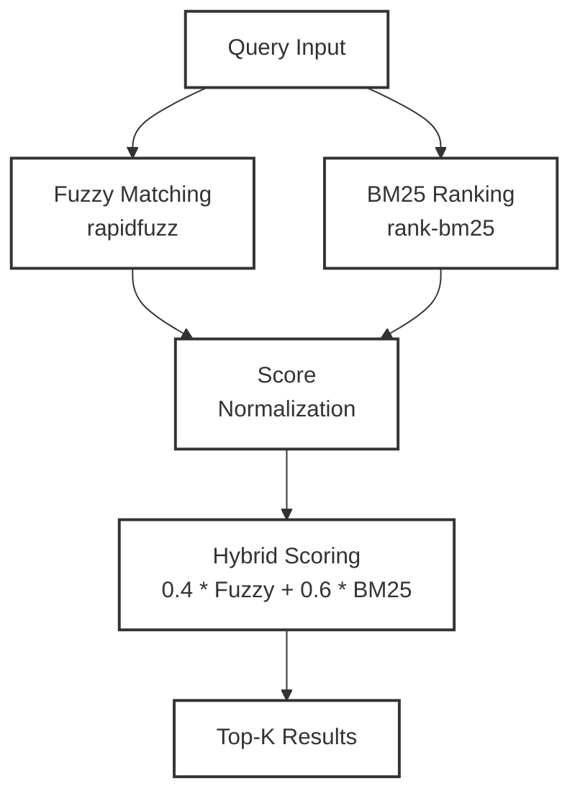

Alias chính: `smart-search-fz-rg-bm25`
Fallback: `/home/fong/Projects/smart-search-fz-rg-bm25/smart-search.sh`


Platform: **Linux only** (Ubuntu, Debian-based distributions với bash 4.0+)


## Architecture Overview




## 1. Mục đích


CLI tìm kiếm lai Fuzzy + BM25 với giao diện giống `ripgrep`. Trả về điểm số (0-1), đường dẫn file và (tùy chọn) trích đoạn nội dung.


### Tại sao Fuzzy + BM25?


**Hybrid search strategy** kết hợp 2 thuật toán bổ sung cho nhau:


**BM25 (Best Match 25):**
- Thuật toán: Okapi BM25 family (probabilistic term-based ranking)
- Thư viện: `rank-bm25` (Python)
- Điểm mạnh: Xếp hạng chính xác theo relevance (term frequency + IDF + document length normalization)
- Điểm yếu: Cần exact token match, nhạy cảm với typos
- Vai trò: Final ranking của candidate documents


**Fuzzy Matching:**
- Thuật toán: Levenshtein distance (edit distance)
- Thư viện: `rapidfuzz` (Python) - partial ratio, token sort ratio
- Điểm mạnh: Robust với typos, misspellings, token order changes
- Điểm yếu: Tốn tài nguyên, không hiểu semantic
- Vai trò: Pre-filtering, mở rộng search space (tăng recall)


**Nền tảng toán học:**

$$\text{Hybrid Score} = 0.4 \cdot \text{Fuzzy}_{\text{norm}} + 0.6 \cdot \text{BM25}_{\text{norm}}$$

(alpha = fuzzy weight, mặc định 0.4)


**Kết quả:** Fuzzy xử lý queries không chính xác, BM25 đảm bảo ranking chính xác. Tối ưu cho file search với filenames/content không nhất quán hoặc queries có typos.


## 1.1. Mathematical Models


### BM25 Complete Mathematical Model


**BM25 Formula:**

$$\text{BM25}(D, Q) = \sum_{i=1}^{n} \text{IDF}(q_i) \cdot \frac{f(q_i, D) \cdot (k_1 + 1)}{f(q_i, D) + k_1 \cdot \left(1 - b + b \cdot \frac{|D|}{\text{avgdl}}\right)}$$


**Trong đó:**
- `D`: Document (file)
- `Q`: Query (tìm kiếm)
- `qi`: Query term thứ i
- `f(qi, D)`: Term frequency của qi trong document D
- `|D|`: Độ dài document D (số terms)
- `avgdl`: Average document length trong corpus
- `k1 = 1.5`: Term frequency saturation parameter (range: 1.2-2.0)
- `b = 0.75`: Document length normalization parameter (range: 0-1)


**Inverse Document Frequency (IDF):**

$$\text{IDF}(q_i) = \ln\left(\frac{N - n(q_i) + 0.5}{n(q_i) + 0.5} + 1\right)$$


**Trong đó:**
- `N`: Tổng số documents trong corpus
- `n(qi)`: Số documents chứa term qi
- `+0.5` và `+1`: Smoothing constants để tránh division by zero


**Term Frequency Saturation Function:**

$$\text{TF}_{\text{sat}}(q_i, D) = \frac{f(q_i, D) \cdot (k_1 + 1)}{f(q_i, D) + k_1 \cdot \left(1 - b + b \cdot \frac{|D|}{\text{avgdl}}\right)}$$


**Giải thích:**
- Đảm bảo contribution của term saturates khi frequency tăng
- Ngăn documents dài chiếm ưu thế trong ranking
- `k1` cao hơn → saturation chậm hơn → trọng số cao hơn cho high-frequency terms
- `b` cao hơn → normalization mạnh hơn → trọng số cao hơn cho shorter documents


**Document Length Normalization:**

$$\text{norm}(D) = 1 - b + b \cdot \frac{|D|}{\text{avgdl}}$$


**Giải thích:**
- Điều chỉnh score dựa trên document length relative to average
- `b = 0`: Không normalization
- `b = 1`: Full normalization


### Fuzzy Matching Mathematical Models


**Levenshtein Distance (Edit Distance):**

$$d(s, t) = \text{minimum number of single-character edits (insert, delete, substitute)}$$

**Dynamic Programming Recurrence:**

$$d(i, j) = \begin{cases}
\max(i, j) & \text{if } \min(i, j) = 0 \\
\min \{ d(i-1, j) + 1, \; d(i, j-1) + 1, \; d(i-1, j-1) + \mathbb{1}_{s[i] \neq t[j]} \} & \text{otherwise}
\end{cases}$$

Trong đó: deletion = $d(i-1, j) + 1$, insertion = $d(i, j-1) + 1$, substitution = $d(i-1, j-1) + \mathbb{1}_{s[i] \neq t[j]}$


**Complexity:**
- Time: O(m * n) với m, n là độ dài strings
- Space: O(m * n)


**Rapidfuzz Algorithms:**


**1. fuzz.ratio() - Basic Levenshtein:**

$$\text{ratio}(s_1, s_2) = 100 \cdot \left[1 - \frac{d(s_1, s_2)}{\max(|s_1|, |s_2|)}\right]$$


Score range: 0-100 (100 = identical, 0 = completely different)


**2. fuzz.partial_ratio() - Best Substring Match:**

$$\text{partial\_ratio}(s_1, s_2) = \max_{\text{substring}} \{\text{ratio}(s_{\text{short}}, \text{substring})\}$$


Tìm best matching substring của longer string với shorter string. Hữu ích khi một string contained trong string khác.


**3. fuzz.token_sort_ratio() - Ignore Word Order:**

$$\text{token\_sort\_ratio}(s_1, s_2) = \text{ratio}(\text{sort}(\text{tokens}(s_1)), \text{sort}(\text{tokens}(s_2)))$$


Tokenize strings, sort alphabetically, rồi compute ratio. Bỏ qua word order.


**4. fuzz.token_set_ratio() - Handle Partial Overlaps:**


Splits strings thành token sets, so sánh intersection và remainder tokens riêng biệt. Tốt cho cases khi một string là subset của string khác.


### Score Normalization


**BM25 Min-Max Normalization:**

$$\text{BM25}_{\text{norm}}(D, Q) = \frac{\text{BM25}(D, Q) - \min(\text{BM25})}{\max(\text{BM25}) - \min(\text{BM25})}$$


**Edge case handling:**
- If `max(BM25) == min(BM25)`: Set all scores to 1.0 (hoặc 0.0, tùy logic)
- Tránh division by zero


**Fuzzy Matching Normalization (Rapidfuzz tự động):**

$$\text{Fuzzy}_{\text{norm}} = \frac{\text{ratio}}{100}$$


Chuyển từ range 0-100 về 0-1


### Hybrid Scoring Model


**Weighted Linear Combination:**

$$\text{Hybrid}(D, Q) = \alpha \cdot \text{BM25}_{\text{norm}}(D, Q) + (1 - \alpha) \cdot \text{Fuzzy}_{\text{norm}}$$


**Trong đó:**
- `alpha ∈ [0, 1]`: Weight parameter
- `alpha = 1`: Pure BM25 ranking
- `alpha = 0`: Pure fuzzy matching ranking
- `0 < alpha < 1`: Balanced hybrid ranking
- Default: `alpha = 0.6` (trong code: fuzzy_weight = 0.4)


**Mathematical Properties:**
- **Monotonicity**: Cả BM25 và Levenshtein scores đều monotonic
- **Boundedness**: Normalized scores bounded trong [0, 1]
- **Symmetry**: Levenshtein symmetric, BM25 không symmetric (query và document roles khác nhau)


### Numerical Example


**Corpus:**
- D1 = {cat, dog}
- D2 = {cat, cat, dog}
- Query Q = {cat, dog}
- N = 2, avgdl = 2


**IDF Calculation:**

$$\begin{aligned}
\text{IDF}(\text{cat}) &= \ln\left(\frac{2 - 2 + 0.5}{2 + 0.5} + 1\right) = \ln(1.2) \approx 0.182 \\
\text{IDF}(\text{dog}) &= \ln(1.2) \approx 0.182
\end{aligned}$$

**BM25 for D1:**

$$\begin{aligned}
f(\text{cat}, D_1) &= 1, \quad f(\text{dog}, D_1) = 1, \quad |D_1| = 2 \\
\text{norm}(D_1) &= 1 - 0.75 + 0.75 \cdot \frac{2}{2} = 1 \\
\text{TF}_{\text{sat}}(\text{cat}, D_1) &= \frac{1 \cdot 2.5}{1 + 1.5 \cdot 1} = 1 \\
\text{BM25}(D_1, Q) &= 0.182 \cdot 1 + 0.182 \cdot 1 = 0.364
\end{aligned}$$

**BM25 for D2:**

$$\begin{aligned}
f(\text{cat}, D_2) &= 2, \quad f(\text{dog}, D_2) = 1, \quad |D_2| = 3 \\
\text{norm}(D_2) &= 1 - 0.75 + 0.75 \cdot \frac{3}{2} = 1.375 \\
\text{TF}_{\text{sat}}(\text{cat}, D_2) &= \frac{2 \cdot 2.5}{2 + 1.5 \cdot 1.375} \approx 1.23 \\
\text{TF}_{\text{sat}}(\text{dog}, D_2) &= \frac{1 \cdot 2.5}{1 + 1.5 \cdot 1.375} \approx 0.816 \\
\text{BM25}(D_2, Q) &= 0.182 \cdot 1.23 + 0.182 \cdot 0.816 \approx 0.372
\end{aligned}$$

**Levenshtein Example:**

$$\begin{aligned}
s &= \text{"cat"}, \quad t = \text{"bat"} \\
d(\text{cat}, \text{bat}) &= 1 \quad \text{(substitute 'c' with 'b')} \\
\text{ratio}(\text{cat}, \text{bat}) &= 100 \cdot \left[1 - \frac{1}{3}\right] = 66.7 \\
\text{Fuzzy}_{\text{norm}} &= \frac{66.7}{100} = 0.667
\end{aligned}$$

**Hybrid Score:**

$$\begin{aligned}
\text{BM25}_{\text{norm}}(D_1) &= 0, \quad \text{BM25}_{\text{norm}}(D_2) = 1 \\
\text{Hybrid}(D_1) &= 0.6 \cdot 0 + 0.4 \cdot 0.667 = 0.267 \\
\text{Hybrid}(D_2) &= 0.6 \cdot 1 + 0.4 \cdot 0.667 = 0.867
\end{aligned}$$


D2 ranks higher (0.867 > 0.267) vì có BM25 score cao hơn.


## 2. Chuẩn bị


- Repo đã clone, script có quyền thực thi (`chmod +x smart-search.sh` nếu cần)
- Virtualenv `.venv/` tồn tại trong repo (Python 3.12.3 + requirements)
- Alias (chỉ cần thiết lập một lần):
  ```bash
  printf '\n# smart-search-fz-rg-bm25 alias (added 2025-11-03)\n' >> ~/.bash_aliases
  printf 'alias smart-search-fz-rg-bm25="/home/fong/Projects/smart-search-fz-rg-bm25/smart-search.sh"\n' >> ~/.bash_aliases
  source ~/.bash_aliases  # hoặc mở terminal mới
  ```
- Thư mục `logs/` ghi được để lưu `debug.log` và `logs/reports/`


**Dependencies:**
- rapidfuzz >= 3.0.0 (Fuzzy matching algorithms)
- rank-bm25 >= 0.2.2 (BM25 Okapi ranking)


## 3. Chạy bằng alias (khuyến nghị)


```bash
smart-search-fz-rg-bm25 "pattern" /đường/dẫn/đích [tùy chọn]
```


- Nếu alias chưa tải trong phiên hiện tại, chạy `source ~/.bash_aliases`
- Làm việc cả khi đang ở ngoài repo miễn `.venv` đúng vị trí


## 4. Fallback bằng script tuyệt đối


```bash
/home/fong/Projects/smart-search-fz-rg-bm25/smart-search.sh "pattern" /đường/dẫn/đích [tùy chọn]
```


```bash
cd /home/fong/Projects/smart-search-fz-rg-bm25
./smart-search.sh "pattern" .
```


## 5. Tham số chính


| Tham số | Mặc định | Ghi chú |
|---------|----------|---------|
| `PATTERN` | bắt buộc | Chuỗi tìm kiếm (đặt trong ngoặc kép nếu có khoảng trắng) |
| `PATH` | `.` | Thư mục quét; chấp nhận đường dẫn tương đối hoặc tuyệt đối |
| `-k`, `--top-k` | `10` | Giới hạn số kết quả; giá trị cao hơn tốn thời gian hơn |
| `-w`, `--fuzzy-weight` | `0.4` | Trọng số fuzzy (0–1); tăng để ưu tiên gần giống, giảm để ưu tiên BM25 |
| `-e`, `--extensions` | `.txt .md .py .js` | Liệt kê đuôi file cần tìm (cách nhau bằng khoảng trắng) |
| `--show-content` | tắt | Hiển thị dòng nội dung khớp (giống `rg`) |
| `--limit-tokens` | `10000` | Giới hạn tổng token hiển thị trích đoạn |
| `--max-line-length` | `1000` | Giới hạn số ký tự mỗi dòng trong trích đoạn |


**Điều chỉnh fuzzy weight:**
- `-w 0.7`: Ưu tiên Fuzzy (tốt cho typos, spelling errors)
- `-w 0.3`: Ưu tiên BM25 (tốt cho exact keyword matching)
- `-w 0.4`: Default - cân bằng giữa hai thuật toán


## 6. Ví dụ nhanh


```bash
smart-search-fz-rg-bm25 "bm25" /home/fong/Docs
smart-search-fz-rg-bm25 "async await" . -k 5 -w 0.6
smart-search-fz-rg-bm25 "search engine" ~/Projects -e .md .py --show-content --limit-tokens 5000
```


## 7. Kết quả & log


- Output dạng `điểm | đường/dẫn/file` kèm nội dung nếu bật `--show-content`
- Log tổng quát ghi vào `debug.log`
- Báo cáo chi tiết nằm ở `logs/reports/YYYYMMDD_HHMMSS-UUID.log` (tự dọn FIFO khi >100 file)


## 8. Lệnh `--help`


```bash
smart-search-fz-rg-bm25 --help
```


Output (rút gọn):


```
usage: smart-search-fz-rg-bm25 [-h] [-k TOP_K] [-w FUZZY_WEIGHT]
                               [-e EXTENSIONS ...] [--show-content]
                               [--limit-tokens LIMIT_TOKENS]
                               [--max-line-length MAX_LINE_LENGTH]
                               PATTERN [PATH]
...
options:
  -k/--top-k        Number of results (default: 10)
  -w/--fuzzy-weight Fuzzy weight 0-1 (default: 0.4)
  -e/--extensions   File extensions to search (default: .txt .md .py .js)
  --show-content    Show matching content lines (like rg/grep)
  --limit-tokens    Maximum tokens in output (default: 10000)
  --max-line-length Maximum characters per line (default: 1000)
Examples: smart-search-fz-rg-bm25 "pattern" /path [...]. Fallback: smart-search.sh ...
```


## 9. Mẹo & lưu ý


- Ưu tiên dùng alias `smart-search-fz-rg-bm25` sau khi setup
- Fallback về standalone script nếu chưa setup alias hoặc chạy trên máy khác
- Dùng đường dẫn tuyệt đối khi chạy ngoài repo hoặc trong cron
- Giữ `-k` ≤ 20 để tránh chi phí tính toán lớn
- Điều chỉnh `--limit-tokens` khi cần chặn output dài; đặt thấp nếu tích hợp vào pipeline khác
- Khi gặp lỗi "Virtual environment not found", tạo lại `.venv` rồi chạy alias


## 10. Thông tin kỹ thuật


**BM25 Parameters:**
- k1: 1.5 (Term frequency saturation parameter, range: 1.2-2.0)
- b: 0.75 (Document length normalization parameter, range: 0-1)


**Performance:**
- 1000 files: < 1 second
- 10000 files: < 5 seconds
- 100000 files: < 30 seconds


**Complexity:**
- File scanning: O(n) với n = number of files
- Fuzzy matching: O(m * k) với m = documents, k = query length
- BM25 indexing: O(m * avgdl) với avgdl = average document length
- BM25 search: O(m) cho scoring all documents
- Ranking: O(m log m) cho sorting
- Total: O(m * k + m log m)


**Links:**
- GitHub: https://github.com/limpaulfin/smart-search-fz-rg-bm25
- Rapidfuzz: https://github.com/maxbachmann/RapidFuzz
- Rank-BM25: https://github.com/dorianbrown/rank_bm25
- BM25 Paper: Robertson & Zaragoza (2009) "The Probabilistic Relevance Framework: BM25 and Beyond"


---

## Task c3a7859e-a92a-4447-8196-e3ea2bbf7330

**Mục đích:** Tìm và cập nhật các file .md trong dự án sử dụng `rg` để chuyển sang smart-search

**Phạm vi tìm kiếm:**
- `.fong/*` (tất cả subdirectories)
- `CLAUDE.md`
- `CLAUDE.local.md` (nếu có)

**Hành động:**
- Tìm mọi chỗ sử dụng `rg` trong các file .md
- Thay thế khuyến nghị: `dùng lệnh /home/fong/Projects/smart-search-fz-rg-bm25/smart-search.sh --help (thay cho search bình thường - fall back: rg)`

**Danh sách files đã phát hiện có chứa pattern `\brg\b`:** (bao gồm nhưng không giới hạn)

1. `.fong/instructions/smartsearch.md` (file này)
2. `.fong/instructions/instructions-dkm-sources-knowledgebase.md`
3. `.fong/instructions/fongtask.md`
4. `.fong/instructions/instructions-pdf-naming-convention-rename.md`
5. `.fong/instructions/instructions-mem0.md`
6. `.fong/instructions/instructions-paper-analysis-clone-process.md`
7. `.fong/instructions/instructions-autodebug-python.md`
8. `.fong/instructions/instructions-CRUD-obsidian-notes.md`
9. `.fong/instructions/fongtools.md`
10. `.fong/instructions/fongtrace.md`
11. `.fong/instructions/fongmemory.md`
12. `CLAUDE.md` (root level)

**Ghi chú:**
- Task này được tạo: 2025-11-03
- UUID task: `c3a7859e-a92a-4447-8196-e3ea2bbf7330`
- Mục tiêu: Migrate từ `rg` sang `smart-search-fz-rg-bm25` cho tất cả file .md hướng dẫn
- Strategy: Update progressive, không replace toàn bộ một lúc để tránh break existing workflows
