# Critical Rules - Part 2 (Diagrams)


**Breadcrumb**: [Main Index](./00-instructions-textor-doc-converter-mermaid-plantuml.md) > Critical Rules Part 2


---


## Rule 4: Diagram Title Convention


**BẮT BUỘC - MANDATORY:** Không dùng tên tool trong tiêu đề diagram.


**Quy tắc:**


- ❌ SAI: `**PlantUML Diagram - Logic:**`
- ✅ ĐÚNG: `**Diagram - Logic:**`


**Pattern:**


```markdown
**Diagram - {Mô tả mục đích}:**
```


---


## Rule 5: PlantUML Professional Styling


**BẮT BUỘC - MANDATORY:** Black & white, simplicity, fit A4.


**Quy tắc bắt buộc:**

```plantuml
@startuml
skinparam monochrome true
skinparam shadowing false
skinparam defaultFontName Arial
skinparam defaultFontSize 10

title Tieu De Diagram

' Content here
@enduml
```





**Xử lý Vietnamese text:**


- ✅ DÙNG tiếng Việt CÓ DẤU - PlantUML support UTF-8
- ✅ Tiếng Anh CHỈ dùng trong ngoặc (giải thích)
- ❌ KHÔNG bỏ dấu


**Xử lý overflow:**


1. Simplify content
2. Remove unnecessary details
3. Use abbreviations
4. Split into multiple diagrams


**Forbidden:**


- ❌ Màu sắc: `#FFCCCC`, `#CCFFCC`
- ❌ Emoji trong PlantUML
- ❌ Bỏ dấu tiếng Việt


---


## Rule 6: Diagram Priority Order


**BẮT BUỘC - MANDATORY:** Thứ tự ưu tiên khi chọn diagram tool.


**Priority:**


1. **PlantUML** (Highest priority)
2. **Mermaid**
3. **BPMN** (Lowest priority)


---


**Next Step**: [Command Reference](./02-command-reference.md) →
