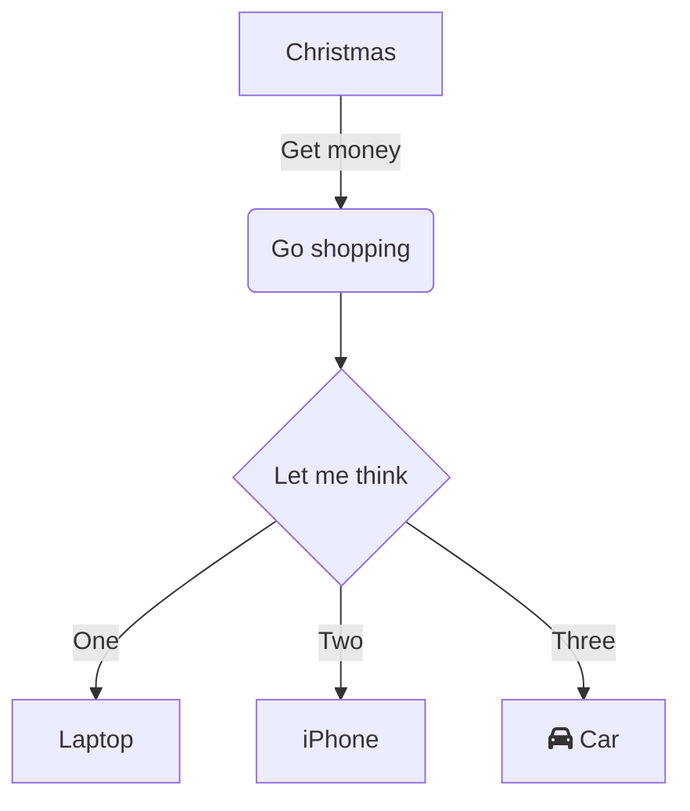
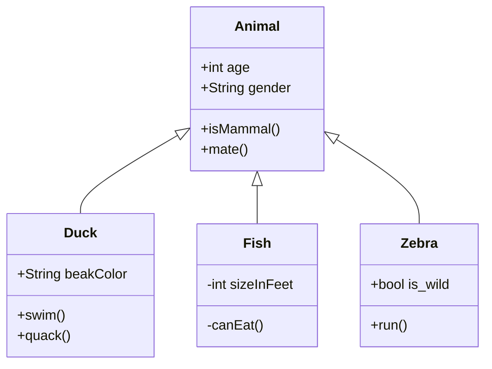

# Mermaid Examples - Basic

**Breadcrumb**: [Main Index](./00-instructions-textor-doc-converter-mermaid-plantuml.md) > [Mermaid Guide](./03-mermaid-guide.md) > Basic Examples

---

#### 1. Flowchart (Sơ đồ luồng)

**Use Cases:**
- Quy trình nghiệp vụ (Business process flow)
- Thuật toán (Algorithm steps)
- Decision making flow

**Syntax:**
- `flowchart TD` = Top-Down direction
- `flowchart LR` = Left-Right direction
- `A[Text]` = Rectangle node
- `B(Text)` = Rounded node
- `C{Text}` = Diamond (decision)
- `-->` = Arrow connection
- `-->|Label|` = Labeled arrow

---

#### 2. Class Diagram (Sơ đồ lớp OOP)

**Use Cases:**
- OOP design documentation
- Class relationships (inheritance, aggregation)
- System architecture

**Syntax:**
- `<|--` = Inheritance
- `+` = Public member
- `-` = Private member
- `ClassName : +type field` = Property
- `ClassName: +method()` = Method

---

#### 3. Sequence Diagram (Sơ đồ tuần tự)

---

**Next Step**: [Mermaid Examples - Advanced](./05-mermaid-examples-advanced.md) →
