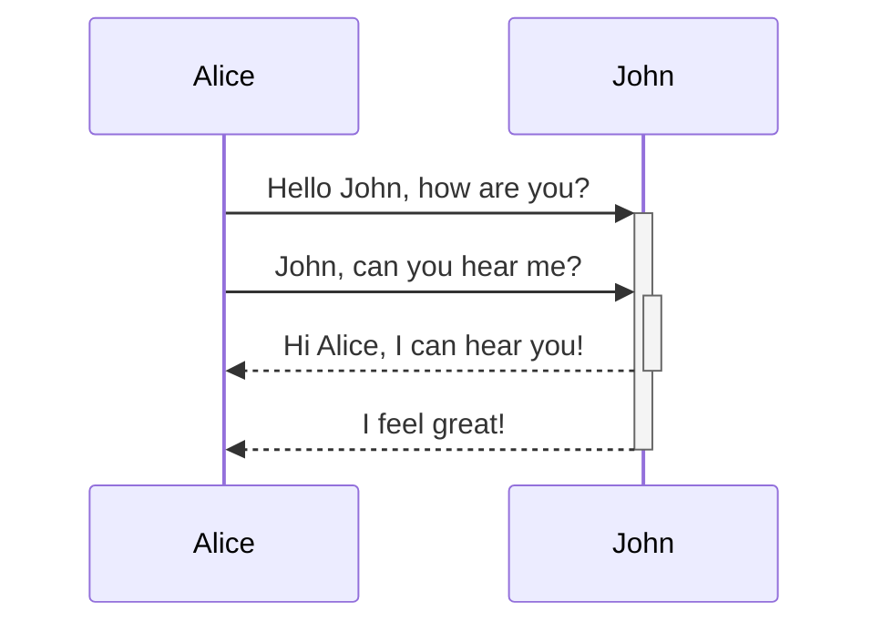
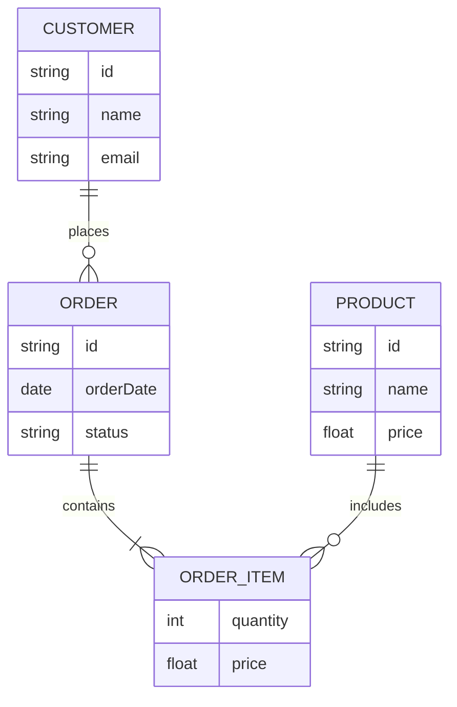
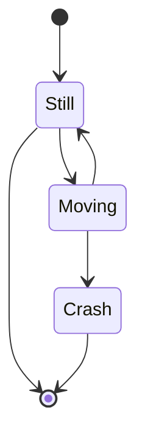

# Mermaid Examples - ER & State Diagrams

**Breadcrumb**: [Main Index](./00-instructions-textor-doc-converter-mermaid-plantuml.md) > [Mermaid Guide](./03-mermaid-guide.md) > ER & State Examples

---

**Use Cases:**
- API interaction flows
- System component communication
- Message passing between objects

**Syntax:**
- `->>` = Solid arrow (synchronous message)
- `-->>` = Dashed arrow (response)
- `+` = Activate lifeline
- `-` = Deactivate lifeline

---

#### 4. ER Diagram (Entity-Relationship)

**Use Cases:**
- Database schema design
- Data modeling
- Relationship mapping

**Syntax:**
- `||--o{` = One-to-many relationship
- `||--|{` = One-to-one or one-to-many
- `EntityName { type field }` = Entity attributes

---

#### 5. State Diagram (Sơ đồ trạng thái)

**Use Cases:**
- State machine design
- Workflow states
- Object lifecycle

**Syntax:**
- `[*]` = Start/End state
- `State1 --> State2` = Transition

---

**Next Step**: [Mermaid Examples - Advanced](./05-mermaid-examples-advanced.md) →
