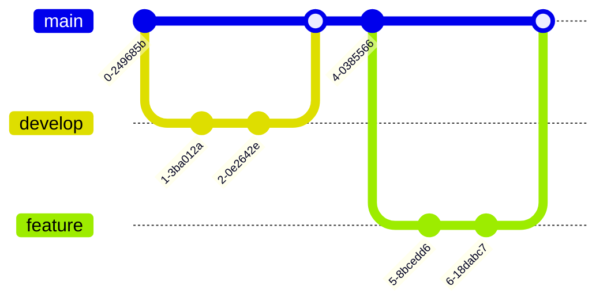

# Mermaid Examples - Advanced Part 1


**Breadcrumb**: [Main Index](./00-instructions-textor-doc-converter-mermaid-plantuml.md) > [Mermaid Guide](./03-mermaid-guide.md) > Advanced Part 1


---


---


#### 6. Gantt Chart (Biểu đồ tiến độ)


**Use Cases:**
- Project timeline planning
- Task scheduling
- Resource allocation

**Syntax:**
- `section Name` = Group tasks
- `Task : id, start, duration` = Task definition
- `after id` = Dependency

---

#### 7. Git Graph (Sơ đồ Git)



**Use Cases:**
- Git workflow visualization
- Branch strategy documentation
- Release planning

---

#### 8. Pie Chart (Biểu đồ tròn)


**Use Cases:**
- Data distribution visualization
- Percentage breakdown
- Statistics reporting

---

#### 9. Mindmap (Sơ đồ tư duy)

```mermaid

---

**Next Step**: [Advanced Part 2](./05b-mermaid-mindmap-timeline.md) →
