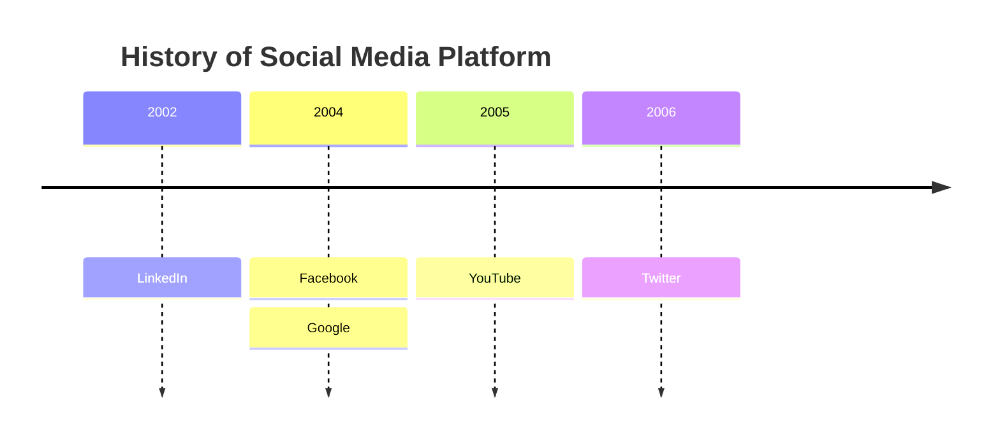
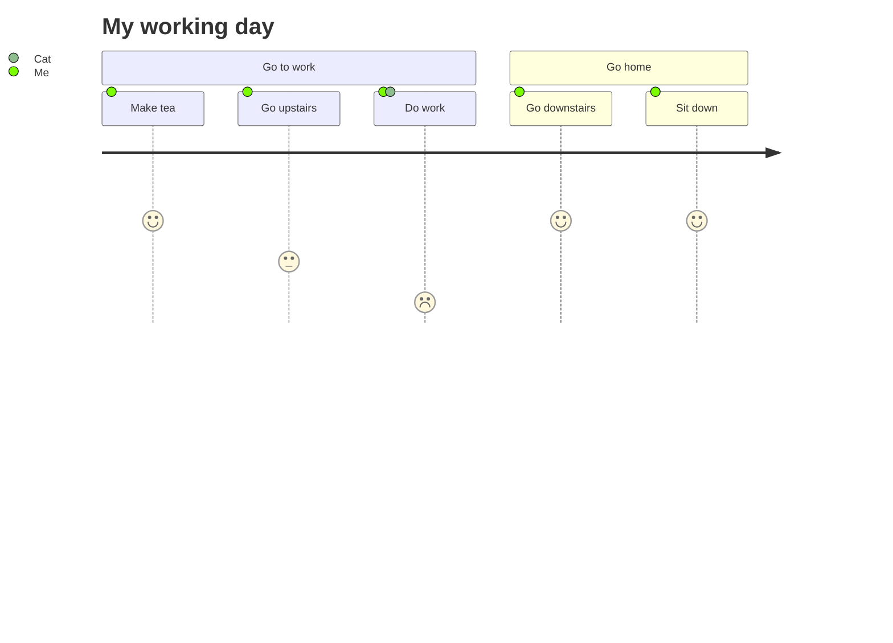

# Mermaid Examples - Advanced Part 2


**Breadcrumb**: [Main Index](./00-instructions-textor-doc-converter-mermaid-plantuml.md) > [Mermaid Guide](./03-mermaid-guide.md) > Advanced Part 2


---


mindmap
  root((mindmap))
    Origins
      Long history
      ::icon(fa fa-book)
      Popularisation
        British popular psychology author Tony Buzan
    Research
      On effectiveness<br/>and features
      On Automatic creation
        Uses
            Creative techniques
            Strategic planning
            Argument mapping
    Tools
      Pen and paper
      Mermaid
```

**Use Cases:**
- Brainstorming
- Knowledge organization
- Concept mapping

---

#### 10. Timeline (Dòng thời gian)



**Use Cases:**
- Historical events
- Product roadmap
- Milestones tracking

---

#### 11. User Journey (Hành trình người dùng)



**Use Cases:**
- UX design
- Customer experience mapping
- Process satisfaction analysis

**Syntax:**
- `Task: score: Actor` = Journey step with satisfaction score (1-5)

---

---

**Next Step**: [PlantUML Guide](./06-plantuml-guide.md) →

---

**Next Step**: [PlantUML Guide](./06-plantuml-guide.md) →
