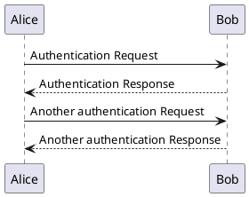
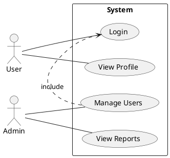

# PlantUML Examples - Part 1


**Breadcrumb**: [Main Index](./00-instructions-textor-doc-converter-mermaid-plantuml.md) > [PlantUML Guide](./06-plantuml-guide.md) > Examples Part 1


---


---


#### 1. Sequence Diagram



**Use Cases:**
- API interactions
- System communication
- Message flow

**Syntax:**
- `@startuml` / `@enduml` = Wrapper
- `->` = Solid arrow (message)
- `-->` = Dashed arrow (response)

---

#### 2. Use Case Diagram



**Use Cases:**
- Requirements analysis
- System functionality
- User interactions

**Syntax:**
- `actor Name` = Actor
- `(Use Case)` = Use case
- `--` = Association
- `.>` = Include/Extend relationship

---

#### 3. Class Diagram

```plantuml
@startuml
class Animal {
  +int age
  +String gender
  +isMammal()
  +mate()
}

class Duck extends Animal {
  +String beakColor
  +swim()
  +quack()
}

class Fish extends Animal {
  -int sizeInFeet
  -canEat()
}


---

**Next Step**: [Examples Part 2](./07b-plantuml-activity-component.md) →
