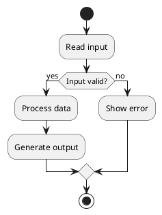
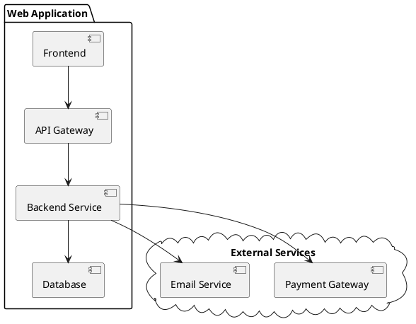

# PlantUML Examples - Part 2


**Breadcrumb**: [Main Index](./00-instructions-textor-doc-converter-mermaid-plantuml.md) > [PlantUML Guide](./06-plantuml-guide.md) > Examples Part 2


---


Animal <|-- Duck
Animal <|-- Fish
@enduml
```

**Use Cases:**
- OOP design
- System architecture
- Class relationships

**Syntax:**
- `class Name { }` = Class definition
- `+` = Public
- `-` = Private
- `<|--` = Inheritance

---

#### 4. Activity Diagram



**Use Cases:**
- Business process
- Algorithm flow
- Workflow

**Syntax:**
- `start` / `stop` = Start/End
- `:Action;` = Activity
- `if (condition) then` = Decision

---

#### 5. Component Diagram



**Use Cases:**
- System architecture
- Component dependencies
- Service integration

**Syntax:**
- `package "Name" { }` = Package/Group
- `[Component]` = Component
- `-->` = Dependency

---

---

**Next Step**: [PlantUML Salt Guide](./08-plantuml-salt-guide.md) →

---

**Next Step**: [Salt Guide](./08-plantuml-salt-guide.md) →
