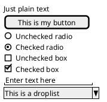

# PlantUML Salt Guide - Part 1

**Breadcrumb**: [Main Index](./00-instructions-textor-doc-converter-mermaid-plantuml.md) > [PlantUML Guide](./06-plantuml-guide.md) > Salt Guide

---

---

## PlantUML Salt - UI Mockup & Wireframe Guide

### What is Salt?

**Salt** is a subproject of PlantUML specifically designed for creating **UI mockups, wireframes, and screen blueprints**.

**Key Purposes:**
- **Graphical Interface Design** - Design UI layouts without coding HTML/CSS
- **Website Wireframes** - Create page schematics and screen blueprints
- **Functionality over Aesthetics** - Focus on structure and user flow
- **Rapid Prototyping** - Quick mockups for design iteration

**Use Cases:**
- Developers: Visualize interface elements and navigation
- Designers: Create low-to-high fidelity wireframes
- UX Professionals: Map user flows and interactions
- Business Analysts: Align requirements with visual design

---

### Basic Widgets

#### Syntax Overview

Salt diagrams start with `@startsalt` and end with `@endsalt`. All content must be enclosed in braces `{ }`.

**Available Widgets:**

| Widget | Syntax | Example |
|--------|--------|---------|
| **Button** | `[Button Text]` | `[Cancel]`, `[OK]` |
| **Radio Button** | `()` unchecked, `(X)` checked | `() Option 1`, `(X) Option 2` |
| **Checkbox** | `[]` unchecked, `[X]` checked | `[] Agree`, `[X] Checked` |
| **Text Input** | `"text here   "` | `"Enter username   "` |
| **Droplist (closed)** | `^Option^` | `^Select Country^` |
| **Droplist (open)** | `^Option^^ item1^^ item2^` | `^Countries^^ Vietnam^^ USA^` |

#### Basic Widgets Example

**Output**: Login form with various input types

---

### Grid Layout

#### Using `|` for Table/Grid

Use `|` to create columns in a grid layout.

**Basic Grid Example:**

```plantuml
@startsalt
{
  Login    | "MyName   "
  Password | "****     "
  [Cancel] | [  OK   ]
}
@endsalt
```

**Grid Modifiers** (placed after opening `{`):

| Modifier | Description | Example |
|----------|-------------|---------|
| `{` | No border | `{ Login \| "text" }` |
| `{#` | Display all borders | `{# Login \| "text" }` |
| `{!` | Display all outer borders | `{! Login \| "text" }` |

---

**Next Step**: [Salt Guide Part 2](./08b-plantuml-salt-grid.md) →
