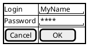
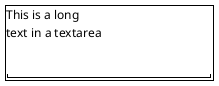
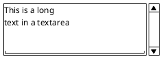
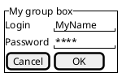

# PlantUML Salt Guide - Part 2 (Grid Layout)

**Breadcrumb**: [Main Index](./00-instructions-textor-doc-converter-mermaid-plantuml.md) > [PlantUML Guide](./06-plantuml-guide.md) > Salt Guide Part 2

---

| `{!` | Display all outer borders | `{! Login \| "text" }` |
| `{-` | Dash border | `{- Login \| "text" }` |
| `{+` | Opening a new window | `{+ ... }` |

**Example with Borders:**

---

### Advanced Features

#### 1. Text Area (Multiline Input)

**Syntax:**
- Use `.` to fill vertical space
- Last line with spaces `"      "` to set width

**With Scroll Bars:**

| Scroll Type | Syntax | Description |
|-------------|--------|-------------|
| Horizontal + Vertical | `{S` | Both scrollbars |
| Horizontal only | `{SI` | Horizontal bar |
| Vertical only | `{S-` | Vertical bar |

---

#### 2. Group Box `{^"Title"`

Create grouped sections with titles:

---

#### 3. Separators

Use different separators for visual division:

| Separator | Style |
|-----------|-------|
| `..` | Dotted line |
