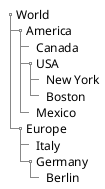
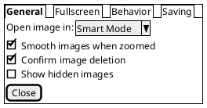
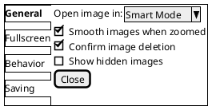

# PlantUML Salt - Advanced Part 1


**Breadcrumb**: [Main Index](./00-instructions-textor-doc-converter-mermaid-plantuml.md) > [PlantUML Guide](./06-plantuml-guide.md) > [Salt Guide](./08-plantuml-salt-guide.md) > Advanced Part 1


---


---


#### 4. Tree Widget `{T`

Create hierarchical tree structures with `+` notation:



**Levels:**
- `+` = Level 1
- `++` = Level 2
- `+++` = Level 3
- etc.

---

#### 5. Tabs `{/`

**Horizontal Tabs:**



**Vertical Tabs:**



---

#### 6. Menu `{*`

Create menu bars:

```plantuml
@startsalt
{+
{* File | Edit | Source | Refactor }
{/ General | Fullscreen | Behavior | Saving }
{

---

**Next Step**: [Salt Advanced Part 2](./09b-plantuml-salt-tabs-menu.md) →
