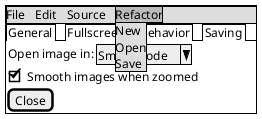
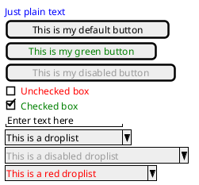
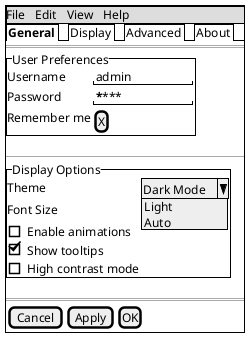

# PlantUML Salt - Advanced Part 2 (Tabs, Menu, Colors)


**Breadcrumb**: [Main Index](./00-instructions-textor-doc-converter-mermaid-plantuml.md) > [PlantUML Guide](./06-plantuml-guide.md) > [Salt Guide](./08-plantuml-salt-guide.md) > Advanced Part 2


---


  { Open image in: | ^Smart Mode^ }
  [X] Smooth images when zoomed
  [X] Confirm image deletion
  [ ] Show hidden images
}
[Close]
}
@endsalt
```

**Open Menu Items:**



---

#### 7. Colors

Add colors to widgets using `<color:ColorName>` or `<color:#HexCode>`:



**Supported Colors:**
- Named: `Blue`, `Red`, `Green`, `Yellow`, `Orange`, `Purple`
- Hex codes: `#9a9a9a`, `#ff0000`, `#00ff00`

---

### Salt Complete Example - Settings Dialog



---

### Salt Quick Reference

#### Widget Cheat Sheet

---

**Next Step**: [PlantUML Salt Examples](./10-plantuml-salt-examples.md) →

---

**Next Step**: [Salt Examples](./10-plantuml-salt-examples.md) →
