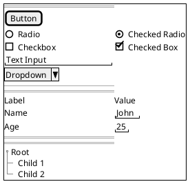

# PlantUML Salt - Examples & Best Practices


**Breadcrumb**: [Main Index](./00-instructions-textor-doc-converter-mermaid-plantuml.md) > [PlantUML Guide](./06-plantuml-guide.md) > [Salt Guide](./08-plantuml-salt-guide.md) > Examples


---




---

### Salt Best Practices

**1. Layout Structure:**
- Always enclose content in `{ }`
- Use `{+` for window with title bar
- Use `|` for column separation
- Use separators (`..`, `==`, `~~`, `--`) for sections

**2. Spacing:**
- Add spaces in text inputs `"text   "` to control width
- Use `.` for vertical spacing in text areas
- Leave blank lines for visual separation

**3. Nesting:**
- Nest `{ }` blocks for complex layouts
- Combine tabs `{/`, menus `{*`, and grids `{#`
- Group related elements in group boxes `{^"Title"`

**4. Mockup Fidelity:**
- **Low Fidelity**: Basic widgets, no colors
- **Medium Fidelity**: Add borders `{#`, separators, grouping
- **High Fidelity**: Add colors, tabs, menus, realistic content

---

### When to Use Salt vs Mermaid

| Feature | PlantUML Salt | Mermaid |
|---------|---------------|---------|
| **UI Mockups** | ✅ Excellent - Purpose-built | ❌ Not supported |
| **Wireframes** | ✅ Native support | ❌ Not supported |
| **Forms/Dialogs** | ✅ Built-in widgets | ❌ Not supported |
| **Flowcharts** | ❌ Not supported | ✅ Excellent |
| **Diagrams** | ⚠️ Limited (use PlantUML) | ✅ Excellent |
| **Syntax** | More verbose | Simpler |
| **Use Case** | UI/UX Design | Documentation, Flows |

**Recommendation:**
- **Salt**: For UI mockups, wireframes, form layouts, screen designs
- **Mermaid**: For flowcharts, sequence diagrams, ER diagrams, Gantt charts
- **PlantUML (non-Salt)**: For UML diagrams, class diagrams, component diagrams

---

### Salt Resources

**Documentation:**
- Official: https://plantuml.com/salt
- Examples: Use "Edit online" links on PlantUML website
- Test online: https://www.plantuml.com/plantuml/

**Export with Textor:**
```bash
# Export markdown with Salt diagrams to PDF
/home/fong/Projects/textor-doc-converter/run-807f321188c6.sh '{"command":"export-md-to-pdf","data":"your-mockup.md"}'
```

**Common Errors:**
1. Missing `{ }` enclosure → Always wrap in braces
2. Missing `@startsalt` / `@endsalt` → Required wrapper
3. Incorrect `|` spacing → Use spaces around `|` for alignment
4. Nested braces mismatch → Count opening/closing braces

---

---

**Next Step**: [XeLaTeX Alternative](./11-xelatex-alternative.md) →
